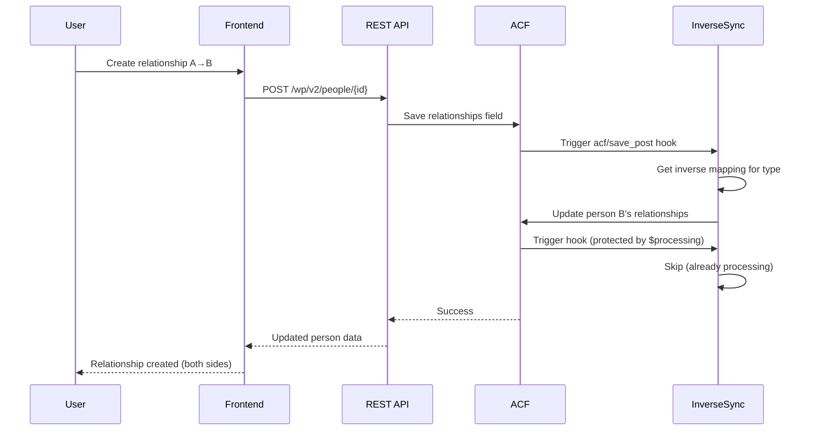
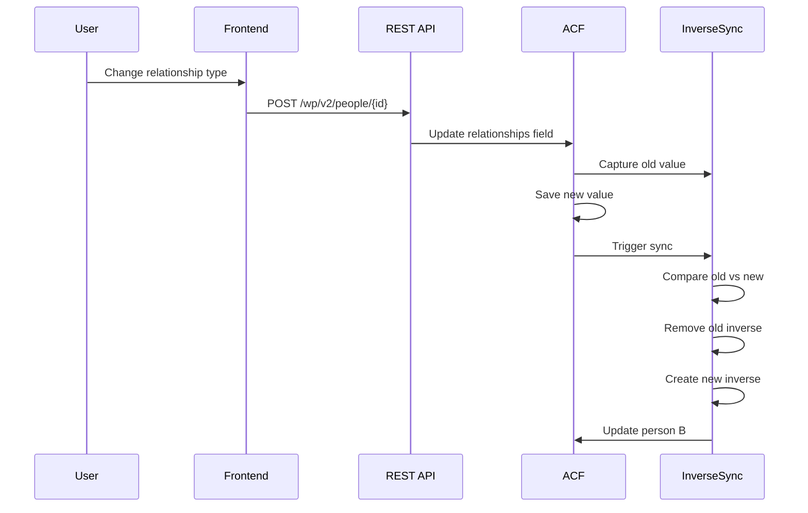

# Relationship System Architecture

## Overview

This document describes the technical architecture of the bidirectional relationship system, including how it works under the hood and how to extend it.

> **Note:** This document focuses specifically on the relationship sync system. For broader system documentation, see the [Documentation Index](#related-documentation) at the end of this file.

## System Components

### Backend Components

#### STADION_Inverse_Relationships Class

**File**: `includes/class-inverse-relationships.php`

The core class that handles automatic inverse relationship synchronization.

**Key Methods**:

- `sync_inverse_relationships($post_id)`: Main entry point called when a person is saved
- `sync_single_inverse_relationship()`: Creates or updates a single inverse relationship
- `remove_inverse_relationship()`: Removes an inverse relationship when original is deleted
- `normalize_relationships()`: Handles different ACF return formats for comparison
- `capture_old_relationships()`: Captures old relationship values before ACF updates them

**Hooks Used**:

- `acf/update_value/name=relationships`: Captures old values before update
- `acf/save_post`: Triggers sync after relationships are saved

**Data Flow**:

```
User saves person → ACF saves relationships field → 
capture_old_relationships() stores old value → 
ACF updates field → 
sync_inverse_relationships() compares old vs new → 
sync_single_inverse_relationship() creates/updates inverses → 
update_field() saves inverse (triggers hook again, but protected by $processing)
```

#### ACF Field Structure

**Person Fields** (`acf-json/group_person_fields.json`):

```json
{
  "name": "relationships",
  "type": "repeater",
  "sub_fields": [
    {
      "name": "related_person",
      "type": "post_object",
      "return_format": "id"
    },
    {
      "name": "relationship_type",
      "type": "taxonomy",
      "taxonomy": "relationship_type",
      "return_format": "id"
    },
    {
      "name": "relationship_label",
      "type": "text"
    }
  ]
}
```

**Relationship Type Fields** (`acf-json/group_relationship_type_fields.json`):

```json
{
  "name": "inverse_relationship_type",
  "type": "taxonomy",
  "taxonomy": "relationship_type",
  "return_format": "id"
}
```

### Frontend Components

#### RelationshipForm Component

**File**: `src/pages/People/RelationshipForm.jsx`

- Form for creating/editing individual relationships
- Uses `SearchablePersonSelector` for person selection
- Fetches relationship types from REST API
- Updates person's relationships array via REST API

#### RelationshipTypes Component

**File**: `src/pages/Settings/RelationshipTypes.jsx`

- Management interface for relationship types
- Create, edit, delete relationship types
- Configure inverse mappings using `SearchableRelationshipTypeSelector`
- Updates taxonomy terms via REST API

#### API Client

**File**: `src/api/client.js`

**Methods**:

- `getRelationshipTypes()`: Fetch all relationship types
- `createRelationshipType()`: Create new relationship type
- `updateRelationshipType()`: Update relationship type (including ACF fields)
- `deleteRelationshipType()`: Delete relationship type

### REST API Integration

#### ACF Field Exposure

**File**: `includes/class-rest-api.php`

The REST API exposes ACF fields for relationship types:

```php
add_filter('rest_prepare_relationship_type', 'add_acf_to_relationship_type');
add_action('rest_insert_relationship_type', 'update_relationship_type_acf');
```

This allows the frontend to:
- Read inverse relationship type mappings
- Update inverse mappings via REST API

## Data Flow Diagrams

### Creating a Relationship



### Updating a Relationship



## Extension Points

### Adding Custom Relationship Logic

To add custom logic when relationships are created:

```php
// In your theme's functions.php or a custom plugin
add_action('stadion_relationship_created', function($from_person_id, $to_person_id, $relationship_type_id) {
    // Your custom logic here
}, 10, 3);
```

### Filtering Inverse Mappings

To override inverse mappings programmatically:

```php
add_filter('stadion_inverse_relationship_type', function($inverse_type_id, $relationship_type_id, $from_person_id, $to_person_id) {
    // Custom logic to determine inverse
    return $inverse_type_id;
}, 10, 4);
```

### Custom Gender Resolution

To customize gender-dependent resolution:

```php
add_filter('stadion_resolve_gender_dependent_type', function($resolved_type_id, $group, $gender, $related_person_id) {
    // Custom resolution logic
    return $resolved_type_id;
}, 10, 4);
```

## Database Structure

### Relationships Storage

Relationships are stored in WordPress post meta:

- **Meta Key**: `relationships` (ACF field)
- **Meta Value**: Serialized array of relationship objects
- **Post Type**: `person`

Each relationship entry:
```php
[
    'related_person' => 123,        // Person post ID
    'relationship_type' => 45,      // Taxonomy term ID
    'relationship_label' => '',     // Optional custom label
]
```

### Inverse Mappings Storage

Inverse mappings are stored in taxonomy term meta:

- **Taxonomy**: `relationship_type`
- **Meta Key**: `inverse_relationship_type` (ACF field)
- **Meta Value**: Taxonomy term ID of the inverse type

## Performance Considerations

### Caching

- Relationship types are cached by TanStack Query on the frontend
- WordPress caches taxonomy terms internally
- ACF fields are cached by WordPress object cache (if enabled)

### Optimization

- The `$processing` array prevents infinite loops
- Old relationship values are captured once per save operation
- Normalization happens in memory before comparison

### Scalability

- The system processes relationships one person at a time
- For bulk imports, consider batching person updates
- Large numbers of relationships per person may impact performance

## Security

### Access Control

- Relationship creation respects `STADION_Access_Control` permissions
- Users can only create relationships for people they can access
- Inverse relationships inherit the same access restrictions

### Data Validation

- Person IDs are validated before creating inverses
- Relationship type IDs are validated against taxonomy
- ACF field values are sanitized by ACF Pro

## Testing

### Unit Testing Considerations

When testing the relationship system:

1. **Test inverse creation**: Verify correct inverse is created
2. **Test inverse updates**: Verify inverse updates when original changes
3. **Test inverse deletion**: Verify inverse is removed when original is deleted
4. **Test edge cases**: Missing people, missing types, circular references
5. **Test gender resolution**: Verify gender-dependent types resolve correctly

### Manual Testing Checklist

- [ ] Create relationship → verify inverse created
- [ ] Edit relationship type → verify inverse updated
- [ ] Delete relationship → verify inverse deleted
- [ ] Create symmetric relationship → verify same type on both sides
- [ ] Create gender-dependent relationship → verify correct type resolved
- [ ] Test with missing gender → verify fallback behavior
- [ ] Test with missing inverse mapping → verify no inverse created

## Future Enhancements

Potential improvements to the system:

1. **Gender-dependent groups**: Support for grouping gender variants (aunt/uncle, niece/nephew)
2. **Bulk operations**: Tools for bulk updating relationship types
3. **Relationship validation**: Prevent invalid relationship combinations
4. **Relationship history**: Track when relationships were created/modified
5. **Import/export**: Tools for exporting relationship data

---

## Related Documentation

### Core System Documentation

| Document | Description |
|----------|-------------|
| [Data Model](./data-model.md) | Post types, taxonomies, and ACF field definitions |
| [Access Control](./access-control.md) | Row-level security and user permissions |
| [REST API](./rest-api.md) | All API endpoints (WordPress + custom) |
| [PHP Autoloading](./php-autoloading.md) | Conditional class loading system |

### Feature Documentation

| Document | Description |
|----------|-------------|
| [Relationships](./relationships.md) | How bidirectional relationships work |
| [Relationship Types](./relationship-types.md) | Configuring relationship type mappings |
| [Import](./import.md) | Contact import from vCard, Google, Monica |
| [iCal Feed](./ical-feed.md) | Calendar subscription system |
| [Reminders](./reminders.md) | Email notification system |
| [Family Tree](./family-tree.md) | Family tree visualization |

### Frontend Documentation

| Document | Description |
|----------|-------------|
| [Frontend Architecture](./frontend-architecture.md) | React SPA structure and patterns |

### Project Documentation

| Document | Description |
|----------|-------------|
| [README](../README.md) | Project overview and quick start |
| [AGENTS.md](../AGENTS.md) | AI agent guidance and development rules |
| [CHANGELOG](../CHANGELOG.md) | Version history |

