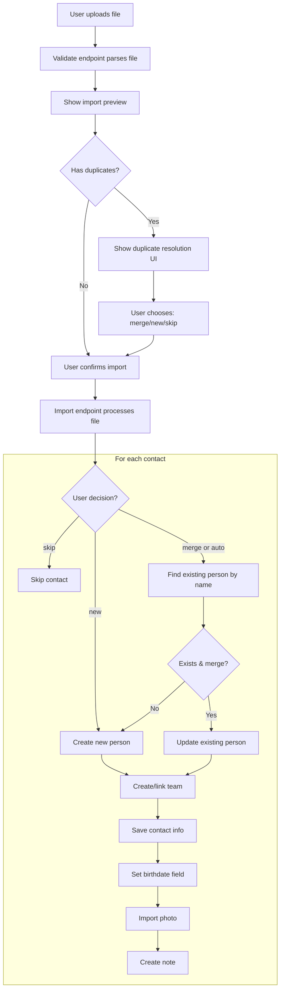

# Contact Import System

## Overview

Rondo Club supports importing contacts from multiple sources:

- **vCard (.vcf)**: Universal contact format from Apple Contacts, Outlook, Android, and most contact apps
- **Google Contacts CSV**: Export from Google Contacts

All import methods support duplicate detection - contacts with matching first and last names are updated instead of duplicated.

## Supported Import Sources

### vCard Import

vCard is a universal standard format supported by virtually all contact management systems.

**Supported vCard Versions**: 2.1, 3.0, 4.0

**File Extensions**: `.vcf`, `.vcard`

**Features**:
- Single contact or multiple contacts per file
- Base64-encoded photos and photo URLs
- Line folding (RFC 5322 compliant)

**Field Mapping**:

| vCard Field | Rondo Club Field |
|-------------|--------------|
| `N` (Name) | `first_name`, `infix` (position 3), `last_name` |
| `FN` (Formatted Name) | Fallback for `first_name`/`last_name` |
| `NICKNAME` | `nickname` |
| `TEL` | `contact_info` (phone/mobile) |
| `EMAIL` | `contact_info` (email) |
| `ADR` | `contact_info` (address) |
| `ORG` | Creates Team + `work_history` |
| `TITLE` | `work_history.job_title` |
| `BDAY` | `birthdate` field on person |
| `PHOTO` | Post thumbnail |
| `URL` | `contact_info` (detects LinkedIn, Twitter, etc.) |
| `NOTE` | Creates note (comment) |

### Google Contacts CSV Import

Export from Google Contacts using the "Google CSV" format.

**How to Export**:
1. Go to [contacts.google.com](https://contacts.google.com)
2. Click "Export" in the left sidebar
3. Select "Google CSV" format
4. Click "Export"

**Features**:
- Interactive duplicate detection with user choice
- Photo sideloading from Google profile URLs
- Supports both old and new Google CSV column formats

**Field Mapping**:

| Google Field | Rondo Club Field |
|--------------|--------------|
| `Given Name` or `First Name` | `first_name` |
| `Additional Name` or `Middle Name` | `infix` (tussenvoegsel) |
| `Family Name` or `Last Name` | `last_name` |
| `Name` | Fallback for name parsing |
| `Nickname` | `nickname` |
| `E-mail 1 - Value` (through 5) | `contact_info` (email) |
| `Phone 1 - Value` (through 5) | `contact_info` (phone/mobile) |
| `Address 1 - Formatted` (through 3) | `contact_info` (address) |
| `Website 1 - Value` (through 3) | `contact_info` (website/social) |
| `Team 1 - Name` or `Team Name` | Creates Team |
| `Team 1 - Title` or `Team Title` | `work_history.job_title` |
| `Birthday` | `birthdate` field on person |
| `Photo` | Profile photo (sideloaded from URL) |
| `Notes` | Creates note (comment) |

**Photo Import**:
- Photos are downloaded from Google's `lh3.googleusercontent.com` URLs
- Only imported if the contact doesn't already have a profile photo
- Filename is generated from the person's name (e.g., `john-doe.jpg`)

## API Endpoints

### vCard Import

**Validate File**:
```
POST /wp-json/rondo/v1/import/vcard/validate
Content-Type: multipart/form-data

file: <vCard file>
```

**Response**:
```json
{
  "valid": true,
  "version": "vcard",
  "summary": {
    "contacts": 25,
    "teams_count": 8,
    "birthdays": 15,
    "photos": 20,
    "notes": 10
  }
}
```

**Import File**:
```
POST /wp-json/rondo/v1/import/vcard
Content-Type: multipart/form-data

file: <vCard file>
```

**Response**:
```json
{
  "success": true,
  "stats": {
    "contacts_imported": 20,
    "contacts_updated": 5,
    "contacts_skipped": 0,
    "teams_created": 8,
    "birthdays_set": 15,
    "notes_created": 10,
    "photos_imported": 18,
    "errors": []
  }
}
```

### Google Contacts Import

**Validate File**:
```
POST /wp-json/rondo/v1/import/google-contacts/validate
Content-Type: multipart/form-data

file: <CSV file>
```

**Response** (includes duplicates):
```json
{
  "valid": true,
  "version": "google-contacts",
  "summary": {
    "contacts": 25,
    "teams_count": 8,
    "birthdays": 15,
    "photos": 12,
    "notes": 10
  },
  "duplicates": [
    {
      "index": 3,
      "csv_name": "John Doe",
      "csv_org": "Acme Corp",
      "csv_email": "john@acme.com",
      "existing_id": 123,
      "existing_name": "John Doe",
      "existing_org": "Acme Corporation",
      "existing_email": "john@example.com",
      "existing_photo": "https://..."
    }
  ]
}
```

**Import File**:
```
POST /wp-json/rondo/v1/import/google-contacts
Content-Type: multipart/form-data

file: <CSV file>
decisions: {"3": "merge", "7": "new", "12": "skip"}
```

**Response**:
```json
{
  "success": true,
  "stats": {
    "contacts_imported": 18,
    "contacts_updated": 5,
    "contacts_skipped": 2,
    "teams_created": 8,
    "birthdays_set": 15,
    "notes_created": 10,
    "photos_imported": 10,
    "errors": []
  }
}
```

## Architecture

### Backend Classes

| Class | File | Purpose |
|-------|------|---------|
| `Rondo\Import\VCardImport` | `includes/class-vcard-import.php` | vCard parsing and import |
| `Rondo\Import\GoogleContactsImport` | `includes/class-google-contacts-import.php` | Google CSV parsing and import |

### Frontend Components

| Component | File | Purpose |
|-----------|------|---------|
| `VCardImport` | `src/components/import/VCardImport.jsx` | vCard upload UI |
| `GoogleContactsImport` | `src/components/import/GoogleContactsImport.jsx` | Google CSV upload UI |
| `Import` | `src/pages/Settings/Import.jsx` | Tabbed import page |

### Data Flow



## Duplicate Detection

All import methods detect duplicates by matching on first name AND last name (case-sensitive exact match).

### Google Contacts Import (Interactive)

Google Contacts import provides **user-controlled duplicate handling**:

1. **Validation Phase**: When you upload a file, the system identifies potential duplicates
2. **Decision Phase**: You see a list of matches with side-by-side comparison
3. **Import Phase**: Your decisions are applied during import

**Duplicate Resolution Options:**

| Option | Behavior |
|--------|----------|
| **Update existing** | Merge CSV data into the existing contact (default) |
| **Create new** | Create a new person, even with matching name |
| **Skip** | Don't import this contact at all |

**What gets updated in "Update existing" mode:**
- Contact info is replaced (not merged)
- Work history is replaced
- Photos are imported only if no existing photo
- Notes are always added (not deduplicated)

**API: Validation Response with Duplicates:**

```json
{
  "valid": true,
  "version": "google-contacts",
  "summary": {
    "contacts": 25,
    "teams_count": 8,
    "birthdays": 15,
    "photos": 20,
    "notes": 10
  },
  "duplicates": [
    {
      "index": 3,
      "csv_name": "John Doe",
      "csv_org": "Acme Corp",
      "csv_email": "john@acme.com",
      "existing_id": 123,
      "existing_name": "John Doe",
      "existing_org": "Acme Corporation",
      "existing_email": "john@example.com",
      "existing_photo": "https://..."
    }
  ]
}
```

**API: Import Request with Decisions:**

```json
POST /wp-json/rondo/v1/import/google-contacts
Content-Type: multipart/form-data

file: <CSV file>
decisions: {"3": "merge", "7": "new", "12": "skip"}
```

The `decisions` object maps CSV row indices to actions:
- `merge` - Update existing contact
- `new` - Create new contact
- `skip` - Don't import

### vCard Import (Automatic)

For vCard imports, duplicate handling is automatic:

When a duplicate is found:
- The existing person record is updated
- Contact info is replaced (not merged)
- Work history is replaced
- Photos are only imported if the person has no existing photo
- Notes are always created (not deduplicated)

### Access Control and Duplicates

Duplicate detection respects access control boundaries:
- Only contacts **you can access** are considered for duplicate matching
- Contacts from other users (not shared with you) are invisible to duplicate detection
- This prevents accidentally merging your contacts with someone else's private data

## Extension Points

### Adding New Import Sources

1. Create a new PHP class in `includes/`:

```php
class Rondo_Custom_Import {
    public function __construct() {
        add_action('rest_api_init', [$this, 'register_routes']);
    }
    
    public function register_routes() {
        register_rest_route('rondo/v1', '/import/custom', [
            'methods' => 'POST',
            'callback' => [$this, 'handle_import'],
            'permission_callback' => [$this, 'check_permission'],
        ]);
    }
    
    public function check_permission() {
        return current_user_can('edit_posts');
    }
    
    public function handle_import($request) {
        // Parse file and import contacts
    }
}
```

2. Register the class in `functions.php`:

```php
require_once RONDO_PLUGIN_DIR . '/class-custom-import.php';
new Rondo_Custom_Import();
```

3. Create a React component in `src/components/import/`:

```jsx
export default function CustomImport() {
  // File upload and import UI
}
```

4. Add to the import types in `src/pages/Settings/Import.jsx`.

### Helper Methods

Common operations used across import classes:

**Find existing person**:
```php
private function find_existing_person($first_name, $last_name): ?int
```

**Get or create team**:
```php
private function get_or_create_team($name): int
```

**Set birthdate**:
```php
private function set_birthdate($post_id, $date): void
```

**Import note**:
```php
private function import_note($post_id, $content): void
```

## Troubleshooting

### Common Issues

**"Invalid vCard format"**: File doesn't contain `BEGIN:VCARD` marker. Ensure you're uploading a valid .vcf file.

**"This doesn't appear to be a Google Contacts export"**: CSV file is missing expected column headers. Make sure you selected "Google CSV" format when exporting.

**Photos not importing**: For vCard imports, photos must be base64-encoded or accessible URLs. Some apps export photo references that are no longer accessible.

**Contacts being skipped**: Contacts without a first name AND last name are skipped. Check the source file for incomplete contact records.

### Performance

For large imports (1000+ contacts):
- PHP execution time is extended to 10 minutes
- Memory limit is raised using `wp_raise_memory_limit('admin')`
- Consider splitting very large files into batches

