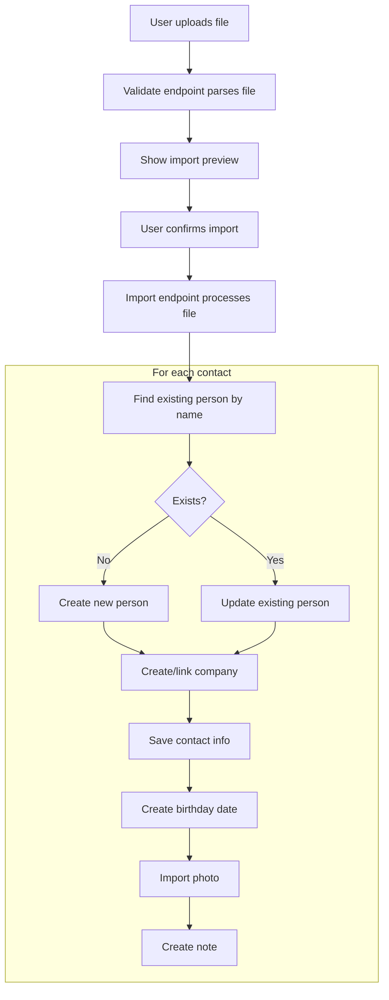

# Contact Import System

## Overview

Caelis supports importing contacts from multiple sources:

- **vCard (.vcf)**: Universal contact format from Apple Contacts, Outlook, Android, and most contact apps
- **Google Contacts CSV**: Export from Google Contacts
- **Monica CRM SQL**: Database export from Monica CRM (legacy)

All import methods support duplicate detection - contacts with matching first and last names are updated instead of duplicated.

## Supported Import Sources

### vCard Import

vCard is a universal standard format supported by virtually all contact management systems.

**Supported vCard Versions**: 2.1, 3.0, 4.0

**File Extensions**: `.vcf`, `.vcard`

**Features**:
- Single contact or multiple contacts per file
- Base64-encoded photos and photo URLs
- Line folding (RFC 5322 compliant)

**Field Mapping**:

| vCard Field | Caelis Field |
|-------------|--------------|
| `N` (Name) | `first_name`, `last_name` |
| `FN` (Formatted Name) | Fallback for `first_name`/`last_name` |
| `NICKNAME` | `nickname` |
| `TEL` | `contact_info` (phone/mobile) |
| `EMAIL` | `contact_info` (email) |
| `ADR` | `contact_info` (address) |
| `ORG` | Creates Company + `work_history` |
| `TITLE` | `work_history.job_title` |
| `BDAY` | Creates `important_date` (birthday) |
| `PHOTO` | Post thumbnail |
| `URL` | `contact_info` (detects LinkedIn, Twitter, etc.) |
| `NOTE` | Creates note (comment) |

### Google Contacts CSV Import

Export from Google Contacts using the "Google CSV" format.

**How to Export**:
1. Go to [contacts.google.com](https://contacts.google.com)
2. Click "Export" in the left sidebar
3. Select "Google CSV" format
4. Click "Export"

**Field Mapping**:

| Google Field | Caelis Field |
|--------------|--------------|
| `Given Name` | `first_name` |
| `Family Name` | `last_name` |
| `Name` | Fallback for name parsing |
| `Nickname` | `nickname` |
| `E-mail 1 - Value` (through 5) | `contact_info` (email) |
| `Phone 1 - Value` (through 5) | `contact_info` (phone/mobile) |
| `Address 1 - Formatted` (through 3) | `contact_info` (address) |
| `Website 1 - Value` (through 3) | `contact_info` (website/social) |
| `Organization 1 - Name` | Creates Company |
| `Organization 1 - Title` | `work_history.job_title` |
| `Birthday` | Creates `important_date` (birthday) |
| `Notes` | Creates note (comment) |

### Monica CRM Import

For users migrating from Monica CRM. Requires SQL database export.

See: Monica CRM documentation for export instructions.

## API Endpoints

### vCard Import

**Validate File**:
```
POST /wp-json/prm/v1/import/vcard/validate
Content-Type: multipart/form-data

file: <vCard file>
```

**Response**:
```json
{
  "valid": true,
  "version": "vcard",
  "summary": {
    "contacts": 25,
    "companies_count": 8,
    "birthdays": 15,
    "photos": 20,
    "notes": 10
  }
}
```

**Import File**:
```
POST /wp-json/prm/v1/import/vcard
Content-Type: multipart/form-data

file: <vCard file>
```

**Response**:
```json
{
  "success": true,
  "stats": {
    "contacts_imported": 20,
    "contacts_updated": 5,
    "contacts_skipped": 0,
    "companies_created": 8,
    "dates_created": 15,
    "notes_created": 10,
    "photos_imported": 18,
    "errors": []
  }
}
```

### Google Contacts Import

**Validate File**:
```
POST /wp-json/prm/v1/import/google-contacts/validate
Content-Type: multipart/form-data

file: <CSV file>
```

**Import File**:
```
POST /wp-json/prm/v1/import/google-contacts
Content-Type: multipart/form-data

file: <CSV file>
```

## Architecture

### Backend Classes

| Class | File | Purpose |
|-------|------|---------|
| `PRM_VCard_Import` | `includes/class-vcard-import.php` | vCard parsing and import |
| `PRM_Google_Contacts_Import` | `includes/class-google-contacts-import.php` | Google CSV parsing and import |
| `PRM_Monica_Import` | `includes/class-monica-import.php` | Monica SQL parsing and import |

### Frontend Components

| Component | File | Purpose |
|-----------|------|---------|
| `VCardImport` | `src/components/import/VCardImport.jsx` | vCard upload UI |
| `GoogleContactsImport` | `src/components/import/GoogleContactsImport.jsx` | Google CSV upload UI |
| `MonicaImport` | `src/components/import/MonicaImport.jsx` | Monica SQL upload UI |
| `Import` | `src/pages/Settings/Import.jsx` | Tabbed import page |

### Data Flow



## Duplicate Detection

All import methods detect duplicates by matching on first name AND last name (case-sensitive exact match).

When a duplicate is found:
- The existing person record is updated
- Contact info is replaced (not merged)
- Work history is replaced
- Photos are only imported if the person has no existing photo
- Notes are always created (not deduplicated)

## Extension Points

### Adding New Import Sources

1. Create a new PHP class in `includes/`:

```php
class PRM_Custom_Import {
    public function __construct() {
        add_action('rest_api_init', [$this, 'register_routes']);
    }
    
    public function register_routes() {
        register_rest_route('prm/v1', '/import/custom', [
            'methods' => 'POST',
            'callback' => [$this, 'handle_import'],
            'permission_callback' => [$this, 'check_permission'],
        ]);
    }
    
    public function check_permission() {
        return current_user_can('edit_posts');
    }
    
    public function handle_import($request) {
        // Parse file and import contacts
    }
}
```

2. Register the class in `functions.php`:

```php
require_once PRM_PLUGIN_DIR . '/class-custom-import.php';
new PRM_Custom_Import();
```

3. Create a React component in `src/components/import/`:

```jsx
export default function CustomImport() {
  // File upload and import UI
}
```

4. Add to the import types in `src/pages/Settings/Import.jsx`.

### Helper Methods

Common operations used across import classes:

**Find existing person**:
```php
private function find_existing_person($first_name, $last_name): ?int
```

**Get or create company**:
```php
private function get_or_create_company($name): int
```

**Import birthday**:
```php
private function import_birthday($post_id, $date, $first_name, $last_name): void
```

**Import note**:
```php
private function import_note($post_id, $content): void
```

## Troubleshooting

### Common Issues

**"Invalid vCard format"**: File doesn't contain `BEGIN:VCARD` marker. Ensure you're uploading a valid .vcf file.

**"This doesn't appear to be a Google Contacts export"**: CSV file is missing expected column headers. Make sure you selected "Google CSV" format when exporting.

**Photos not importing**: For vCard imports, photos must be base64-encoded or accessible URLs. Some apps export photo references that are no longer accessible.

**Contacts being skipped**: Contacts without a first name AND last name are skipped. Check the source file for incomplete contact records.

### Performance

For large imports (1000+ contacts):
- PHP execution time is extended to 10 minutes
- Memory limit is raised using `wp_raise_memory_limit('admin')`
- Consider splitting very large files into batches

