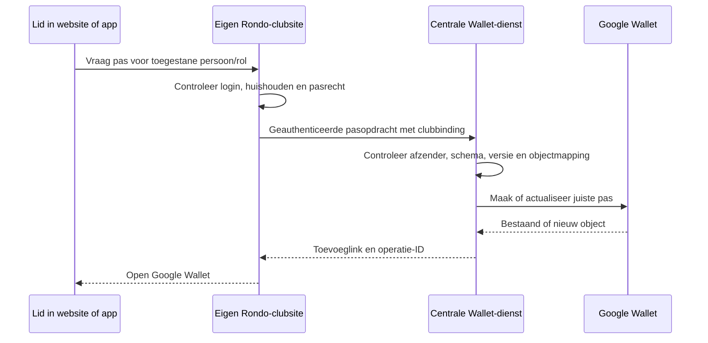

# Centrale Wallet-uitgifte voor Rondo-clubs

Datum: 6 september 2026. Status: ontwerpvoorstel; uitsluitend planning.
Gerelateerd: [eerste apprelease](mobile-app-first-release.md).

## Voorgesteld model

Rondo beheert één nieuw centraal Google Wallet-uitgeversaccount voor nieuwe clubs. Iedere club
krijgt eigen pasontwerpen en een blijvende, onafhankelijke club-ID. Eén serverdienst doet de
Google-aanroepen en ondertekent toevoeglinks. Clubsites bepalen wie welke pas mag ontvangen.
De dienst werkt voor de website en voor de toekomstige app; publicatie van de app is geen voorwaarde.

Google beschrijft zowel één uitgever voor meerdere organisaties als afzonderlijke uitgevers onder
centraal beheer. Eén uitgever is passend zolang clubs geen rechtstreekse Google-API-toegang krijgen.
Die rechten gelden op uitgeversniveau. Rondo moet het gebruik van clubinhoud en merken namens clubs
kunnen verantwoorden volgens de aggregatorvoorwaarden.
[Accountmodel](https://developers.google.com/wallet/smart-tap/introduction/issuer-configuration),
[API-rechten](https://developers.google.com/wallet/reference/rest/v1/permissions),
[Aggregatorvoorwaarden](https://developers.google.com/wallet/generic/resources/terms-of-service)

Publicatietoestemming blijft afzonderlijk nodig in Google Pay & Wallet Console. Controleer
eerst de bestaande Rondo-bedrijfsaccounts; Google Play-toegang verleent deze toestemming niet.
Clubs hoeven in dit voorstel geen eigen Google-proces te doorlopen. Rondo registreert hun
toestemming, branding en toegestane installatie bij aansluiting.

## Wat de huidige implementatie vraagt

Gecontroleerd in broncode, niet via een actuele productie-inventaris:

- `includes/class-membership-pass-google.php` leest uitgevers-ID, passjabloon en credentials
  per installatie; de site maakt rechtstreeks Google-objecten en toevoeglinks.
- Een lidpas gebruikt nu `issuer.member_<person_id>` met eventueel een selectiehash; een gastpas
  `issuer.guest_<guest_pass_id>`. Persoonsnummers kunnen op verschillende clubsites gelijk zijn.
- Alleen het wijzigen van het passjabloon voorkomt zo'n botsing niet: object-ID's zijn uniek
  binnen de uitgever. Rol- en sponsorvarianten moeten ook expliciet in de nieuwe identiteit passen.
- `class-membership-pass-service.php` controleert gebruiker, paskeuze en toegang. De bestaande
  QR-dienst gebruikt clubgebonden ondertekening, pasversie en eventueel verval.
- De huidige generator maakt of actualiseert een pas bij aanvragen. Een betrouwbare achtergrond-
  synchronisatie voor alle wijzigingen en intrekkingen moet als nieuwe functionaliteit worden ontworpen.

## Architectuur en gegevensstroom

De centrale dienst kiest zelf uitgever, class en object-ID op basis van zijn clubregistratie.
Een club mag die identifiers niet vrij aanleveren. Iedere club heeft afzonderlijke, roteerbare
dienstauthenticatie met beperkte rechten. Geen gedeelde Google-sleutel in clubsites of apps.
Gebruik een vast requestformaat met tijdstempel, unieke request-ID, body-integriteitscontrole,
hergebruikcontrole en limieten per club. Sleutel intrekken blokkeert uitsluitend die club.

De clubsite blijft bron van waarheid voor lidmaatschap, bijdrage, rollen, gastclaim en QR-geldigheid.
De Wallet-dienst is geen ledenregister. Hij ontvangt alleen toegestane velden voor de gekozen pas:
weergavenaam, club/pastype, noodzakelijke rolvelden, eventuele geldigheid en ondertekende QR-inhoud.
Geen volledige person-payload, adres, geboortedatum of financiële historie. Beoordeel afzonderlijk
of het huidige KNVB-nummer op de pas noodzakelijk is; voeg het niet automatisch aan nieuwe
centrale opslag toe. QR-inhoud en toevoeg-JWT's gelden als gevoelige pasgegevens.

Operationele opslag: clubregistratie, objectmapping, bronversie, wachtrijstatus, foutcategorie en
correlatie-ID. Bewaar geen volledige paspayload in gewone logs. Bewaar retry-payloads versleuteld
en verwijder ze na afhandeling binnen een vastgelegde termijn. Voorstel: maximaal zeven dagen
voor mislukte taken, daarna opruimen en opnieuw vanuit de club laten aanleveren.

De hosting/runtime wordt bij de technische proef gekozen. Indien WordPress wordt gebruikt,
zijn clubregistraties en taken private CPT's met postmeta, instellingen options en tijdelijke
waarden transients; geen custom tabellen of ruwe SQL. Kies geen nieuwe infrastructuur uitsluitend
voor dit plandocument. Wallet en push kunnen hetzelfde clubregister gebruiken, met aparte
bevoegdheden, secrets en verwerkingsstromen.

### Pasidentiteit en API-contract

Voorgesteld voor nieuwe centrale passen:

- Class: `<issuer>.<club_uuid>_<pass_family>_<template_version>`.
- Object: `<issuer>.<club_uuid>_<opaque_pass_uuid>`.
- Mapping: club + stabiele persoon/gast-ID + pastype + rolvariant → opaque pass-UUID en
  daadwerkelijke uitgever/class/object-ID. Geen domeinnaam als blijvende identiteit.
- Domeinwijziging behoudt club-ID. Een kloon/testsite krijgt een nieuwe club-ID, credentials
  en testuitgever. Templateversie is een bewuste migratie; wijzig haar niet bij iedere release.
- De mapping blijft gelijk bij opnieuw aanvragen; rolvarianten overschrijven elkaar niet.

Voorgesteld dienstcontract: `POST /v1/pass-operations` met bronpasreferentie, bronversie,
actie (upsert/invalidate) en toegestane pasvelden. `GET /v1/pass-operations/<id>` geeft de
geauthenticeerde afzender uitsluitend de eigen status. De endpointnamen zijn ontwerp, niet bestaand.
Een succesvol antwoord bevat de uitkomst; een wachtrijantwoord bevat een operatie-ID en een
duidelijke wachtstatus. Geen nep-succes of toevoeglink naar een nog niet bestaand object.

Updates zijn idempotent en per pas geordend. Een lagere bronversie mag een latere intrekking
niet ongedaan maken. Na timeout controleert de dienst het object voordat opnieuw wordt geschreven.
Gebruik beperkte retries met vertraging voor tijdelijke fouten; authenticatie/configuratiefouten
worden zichtbaar voor beheer. Wijzig met PATCH waar geschikt; stuur altijd een volledige,
bewust gekozen waarde voor velden/arrays die PATCH vervangt.
[Google-updates](https://developers.google.com/wallet/generic/use-cases/updates)

Wijziging van pasrecht, gastvervanging, relevante rol, naam of geldigheid genereert een nieuwe
bronversie en taak. Een periodieke reconciliatie herstelt gemiste taken. Intrekking wijzigt direct
de autoritatieve clubcontrole en zet een Wallet-update klaar. Een vertraagde Wallet-weergave mag
geen toegang verlenen: de scanner controleert actuele rechten/pasversie. Offline scanners vallen
buiten deze release. Bevestig het gekozen Google-objectstate-contract in de proef.

## Behoud van bestaande AWC-passen

**Behoud betekent dezelfde bestaande Google-objecten, toevoegidentiteit en QR-validatie blijven
gebruiken. Een nieuw centraal uitgevers-ID wordt niet over bestaande configuratie heen gezet.**

Voorkeursroute: de dienst ondersteunt naast het nieuwe Rondo-account ook de bestaande AWC-uitgever.
De centrale service krijgt, na toestemming, toegang tot die uitgever en blijft diens bestaande
class- en object-ID's beheren. Nieuwe clubs gebruiken het centrale Rondo-account.
Zo is de bediening centraal zonder een gebruikersmigratie voor AWC te veronderstellen.
Dit vereist verificatie van feitelijk eigendom en beheerrechten; die zijn nog niet live gecontroleerd.

| Stap | Read-only bewijs / concrete wijziging | Controle vóór verdergaan |
|---|---|---|
| 1. Inventaris | Huidige issuer/class, alle bestaande lid- en gastobjecten, rolvarianten, QR-versies en Apple-identiteit vastleggen zonder sleutels te exporteren | Exacte identiteit en eigenaar bevestigd; aantallen en mappings compleet |
| 2. Testisolatie | Twee testclubs met expres gelijke persoonsnummers en meerdere rollen | Geen enkele botsing of kruislingse wijziging |
| 3. Bestaande mapping | Bestaande AWC-object-ID's als vaste legacy-mapping registreren; clubgebonden toegang instellen | Geen object opnieuw aangemaakt of hernoemd |
| 4. Proefpas | Afzonderlijk goedgekeurde testpas via centrale dienst lezen en gericht bijwerken | De reeds opgeslagen pas toont wijziging; opnieuw toevoegen geeft geen duplicaat |
| 5. Beperkte AWC-pilot | Eén goedgekeurde groep via centrale dienst, met maar één actieve schrijver per pas | Oud en nieuw toevoegen, rolkeuzes, gastpas en actuele scancontrole slagen |
| 6. Omschakelen | AWC-verkeer gefaseerd naar dienst; bestaande identifiers en QR-secret behouden | Aantallen/fouten volgen; herstelroute getest |
| 7. Afronden | Lokale Google-credentials pas intrekken/verwijderen na bewezen beheer- en herstelroute | Centrale uitgifte en updates afzonderlijk geverifieerd |

Inventariseer bestaande Wallet-objecten, niet alleen lokale WordPress-records: een huidige
generator kan anders eerdere rolvarianten missen. Migreer geen onduidelijke variant door te gokken.
Als een bestaande pas meerdere betekenissen heeft gekregen, behoud hem en ontwerp een expliciete
vervangingsactie voor de betreffende gebruiker. Wijzig bestaande QR-secret, pasversie of
geldigheid niet als neveneffect van centralisatie.

Als AWC-toegang niet overdraagbaar/delegeerbaar blijkt, blijft de bestaande uitgifte actief en
gaat centrale uitgifte eerst voor nieuwe clubs live. Verhuizing naar een andere uitgever is
een apart traject; ga er niet van uit dat een al opgeslagen pas automatisch meeverhuist.

Rollback kiest per club/pasfamilie één schrijver. Behoud dezelfde issuer/objectmapping en
bijgewerkte bronversies; herstart nooit een oude wachtrij die ingetrokken passen kan activeren.
Test terugschakelen vóór lokale credentials worden opgeruimd. Bestaande passen moeten ook bij
storing van de centrale uitgiftedienst via de clubscanner controleerbaar blijven.

## Apple Wallet en de iPhone-app

Apple-uitgifte blijft voor de eerste app-pilot via de bestaande clubgenerator werken.
De centrale dienst krijgt een providergrens zodat later ook Apple kan worden ondergebracht.
Een Apple Developer-account ondersteunt registratie van Pass Type ID's en ondertekeningscertificaten;
deze inrichting hoort naast de appregistratie bij hetzelfde ontwikkelaarsbeheer.
[Apple Wallet-certificaten](https://developer.apple.com/help/account/capabilities/create-wallet-identifiers-and-certificates)

Behoud bij bestaande Apple-passen de combinatie passTypeIdentifier/serialNumber en juiste
ondertekening. Controleer het huidige ontwikkelteam en certificaatbeheer vóór een centralisatie;
geen automatische overdracht naar een nieuw team beloven. De huidige generator mag niet zonder
toestelbewijs als volledige Apple-pushupdateservice worden beschouwd. Een latere centrale Apple-
updatefunctie vereist apart ontwerp voor apparaatregistratie, pass-updates en certificaatvernieuwing.

## Uitvoering, bewijs en raming

| Fase | Resultaat | Voorlopige inspanning |
|---|---|---|
| W0. Inventaris en toestemmingen | Uitgever/eigendom, mappings, API-proef en goedgekeurde migratieroute | 2–3 dagen plus externe wachttijd |
| W1. Centrale dienst en clubadapter | Clubbinding, objectmapping, uitgifte, versiegestuurde retries en intrekking | 1–2 weken |
| W2. Pilot en migratie | Twee-clubtests, bestaande pas op toestel, storings-/rollbackproef en beheer | 1–2 weken |

Indicatie **3–5 engineeringweken**; opnieuw ramen na W0. Centrale Apple-uitgifte en nieuw
Apple-updateprotocol vallen buiten die indicatie. Google-publicatietoestemming is een externe
afhankelijkheid, geen programmeertaak met gegarandeerde einddatum.

Minimale acceptatie: gelijke lokale ID's tussen clubs botsen niet; ongeldige clubauthenticatie,
andere club-ID en herhaalde oude opdrachten worden geweigerd; timeout-retries geven geen dubbel
object; ingetrokken passen worden niet opnieuw actief; naam/branding-updates behouden identiteit;
bestaande AWC-passen blijven scanbaar volgens actuele regels; clubuitval en Google-uitval hebben
een herstelpad; geen credentials of paspayload in logs. Verifieer iedere productiepilot in een
afzonderlijke read-only controle en op een reeds opgeslagen pas.

Bij aansluiting van een club worden contractueel gebruik van naam/logo, gegevensverwerking,
ondersteuning en vertrek geregeld. Bij vertrek wordt nieuwe uitgifte stopgezet volgens afspraak
en krijgen bestaande passen een expliciet continuïteits- of uitfaseringsplan. Een Rondo-brede
uitgever heeft gedeelde quota en een gezamenlijke storing-/accountimpact; bewaak per club
verbruik en begrens aanvragen zodat één club de andere niet kan verdringen.

Live inventarisatie, toegangswijzigingen, sleutelrotatie en pasmutaties zijn nog niet uitgevoerd.
De volgende onderzoeksfase is W0; daarna worden de exacte pilotobjecten en migratiewijzigingen
voor de productieproef vastgelegd.
