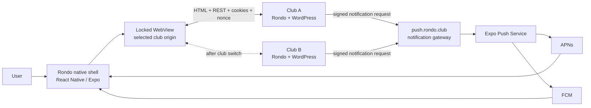
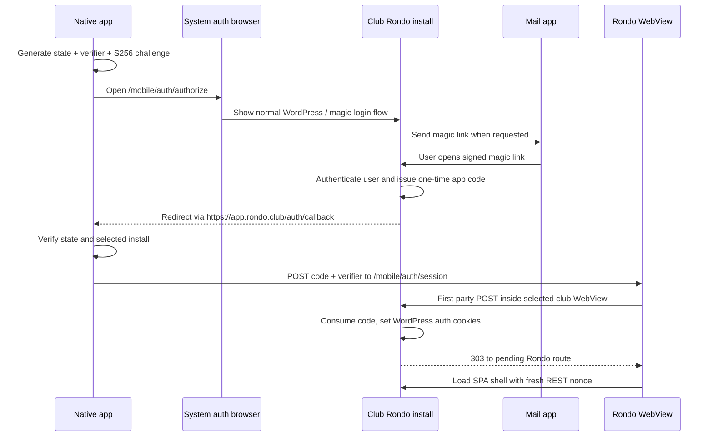
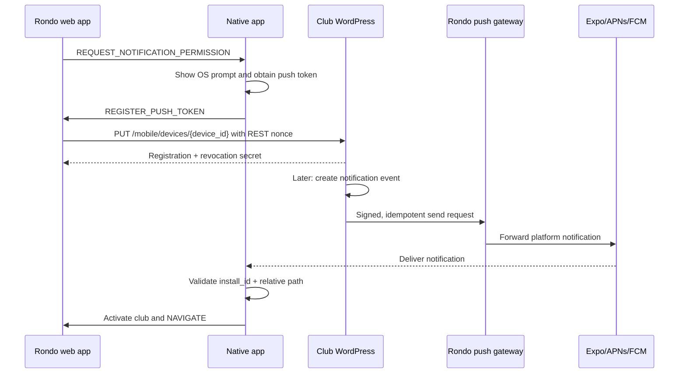

# Rondo Mobile — iPhone and Android app design

**Status:** Proposed design
**Date:** 2026-08-30
**Scope:** One App Store / Google Play app that can connect to any compatible Rondo Club install
**Primary decision:** Build a thin native shell around the hosted Rondo web app, with the club's
domain as a saved setting and native support for authentication, notifications, deep links, camera,
sharing, downloads, and optional biometric app lock.

---

## 1. Executive summary

Yes, this is feasible, and Rondo is already a strong candidate for it.

The current product is a responsive React 19 single-page app backed by WordPress REST endpoints. It
already has an installable PWA, a root-scoped service worker, offline handling, camera-based QR
scanning, file upload, wallet passes, and mobile navigation. Rebuilding that UI in Swift, Kotlin,
Flutter, or React Native would duplicate a large product and create a permanent two-frontend
maintenance burden.

The recommended product is therefore one generic **Rondo** app with a small native shell:

1. On first launch, the user enters or scans their club's Rondo URL.
2. The app verifies that the URL is HTTPS and exposes a compatible Rondo mobile configuration.
3. The app shows the club's name, crest, and domain and lets the user sign in.
4. The main Rondo SPA is loaded from that club's own domain in a locked-down native WebView.
5. The shell adds the native functions the website cannot provide reliably: push notifications,
   safe passwordless login, multi-club switching, notification deep links, OS sharing/downloads,
   app-level biometric lock, and tighter camera/wallet integration.

The domain is not compiled into the app. A user can save multiple clubs and switch between them,
while each club keeps a separate WordPress session and separate notification registration.

This should not be submitted to the stores as a bare website wrapper. Apple explicitly requires an
app to offer value beyond a repackaged website, and Google Play expects meaningful mobile utility.
The first store build should therefore include at least:

- native club setup and switching;
- secure system-browser authentication with a return to the app;
- native push notifications and deep links;
- native QR/camera integration or a fully verified WebView camera path;
- native sharing/download handling; and
- optional Face ID / Touch ID / Android biometric app lock.

### Recommended implementation

| Layer | Recommendation |
|---|---|
| Mobile shell | React Native with Expo development builds / prebuild |
| Web content | The existing hosted Rondo React SPA in `react-native-webview` |
| Club configuration | Public, versioned `GET /wp-json/rondo/v1/mobile/config` endpoint |
| Authentication | System auth session + one-time authorization code + PKCE-style verifier |
| Web session | Existing WordPress login cookies and REST nonce; no bearer-token rewrite |
| Push client | `expo-notifications` |
| Push delivery | Rondo-owned gateway, initially forwarding to Expo Push Service |
| Device storage | Non-secret club metadata locally; sensitive values in Keychain / Keystore |
| Server storage | WordPress options, user meta, transients, and a private notification-event CPT |
| Distribution | One Rondo app in each store, serving all clubs |

### Rough effort

An experienced engineer should expect approximately **8–12 engineering weeks** for a store-ready
v1, plus Apple/Google review time. A narrow internal pilot without the full push gateway and store
polish could be running in roughly **3–4 weeks**. The authentication/cookie proof of concept is the
first gate; it should be completed before committing to the rest of the schedule.

---

## 2. Current Rondo foundation

The recommendation is grounded in the current repository, not in a generic wrapper pattern.

### What already exists

| Capability | Current implementation | Mobile consequence |
|---|---|---|
| Responsive SPA | React, React Router, TanStack Query, Tailwind | Reuse the complete application UI |
| Server-generated shell | [`functions.php`](../../functions.php) injects `window.rondoConfig` | Each club already supplies its own API URL, site name, auth state, and nonce |
| Authentication | WordPress session cookies + `X-WP-Nonce` in [`src/api/client.js`](../../src/api/client.js) | Preserve the existing security model inside the WebView |
| PWA | Manifest, service worker, install UI, offline page | Good browser product; does not replace the multi-club native shell |
| Camera QR scanner | [`src/pages/MembershipPassScanner.jsx`](../../src/pages/MembershipPassScanner.jsx) | Can work in WebView first and move to native scanning if needed |
| Wallet passes | Apple Wallet and Google Wallet membership-pass flows | Native app can improve the handoff without redesigning passes |
| File input/output | Photos, certificates, CSV, PDFs, ICS, vCards | Requires a deliberate WebView download/share compatibility pass |
| Online-state handling | TanStack Query integration and `OfflineBanner` | Reuse web behavior and add a native connection/error surface |
| Notifications | Email channel, daily digest, immediate/digest mentions | Add push as another delivery channel instead of inventing a parallel event model |
| Per-install branding | Site title, club configuration, crest, accent color | Use the selected install's branding inside a generic Rondo binary |

The existing PWA work is documented in
[`docs/prd/pwa-install-plan.md`](pwa-install-plan.md). It remains useful: users who do not want a
store app can keep installing the individual club PWA, and web push can be added later through the
same notification-event layer.

### Important current constraints

1. **The SPA is not a standalone static bundle.** WordPress renders its HTML shell and injects a
   fresh REST nonce and user-specific configuration. The mobile app must load the club origin, not
   merely package the Vite `dist/` directory.
2. **The API client assumes same-origin WordPress cookies.** This is valuable and should be kept.
   Replacing it with mobile bearer tokens would touch every endpoint and materially enlarge the
   security surface.
3. **Passwordless email login crosses application boundaries.** A magic link tapped in Mail opens a
   browser, whose cookies are not the WebView's cookies. A simple WebView login is therefore not a
   complete solution.
4. **Rondo serves sensitive member data, including data about minors.** The shell cannot allow
   arbitrary navigation, permissive JavaScript bridges, cleartext HTTP, or cross-club session
   leakage.
5. **The PWA service worker caches REST GET responses.** The native WebView must not depend on this
   cache, because a persistent API cache can outlive a login and complicate account/club isolation.
6. **Some workflows leave the Rondo origin.** Google/Rabobank OAuth, Mollie checkout, external
   links, wallet installation, PDFs, and downloads need explicit routing rules.

---

## 3. Goals and non-goals

### Goals

The v1 product must:

- ship as one iOS app and one Android app;
- allow a user to enter a Rondo install domain as a setting;
- validate the install before loading it;
- support several saved clubs, with one active club at a time;
- preserve each club's independent data, authorization rules, and WordPress session;
- render the current Rondo SPA without duplicating its screens;
- support existing password and magic-link login flows;
- receive native notifications while the web app is closed;
- open a notification in the correct club and route;
- safely handle same-origin and external navigation;
- preserve camera, upload, wallet, download, and sharing workflows;
- show useful native loading, offline, incompatible-version, and error states;
- permit web releases without a store release when the native protocol is unchanged; and
- meet App Store and Google Play quality/privacy expectations.

### Non-goals for v1

- A complete offline CRM with offline writes and conflict resolution.
- Reimplementing Rondo's screens in native UI.
- Running WordPress or the REST API on the device.
- Combining data from different clubs in one web screen.
- One white-label store binary per club.
- Background location, contacts scraping, advertising IDs, or behavioral ad tracking.
- Silent background synchronization of the full member database.
- Replacing the existing PWA.
- Replacing WordPress roles, permissions, cookies, or REST nonces.

### Product interpretation of “multiple clubs”

The minimum requirement is that the install URL can be changed. The recommended v1 goes slightly
further and stores multiple club profiles because it costs little once dynamic origins exist and
prevents an awkward logout/reconfigure cycle for people who help more than one club.

Only one club WebView is active at a time. There is no merged dashboard. Notifications may arrive
from any saved club; tapping one activates that club before navigating.

---

## 4. Users and primary journeys

### Personas

| Persona | Important mobile jobs |
|---|---|
| Member / parent | View household, sign up for duties, show/add membership pass, update profile |
| Gate volunteer | Select a match and scan membership QR codes quickly |
| Team/club coordinator | Find people, view teams, complete todos, react to mentions |
| Treasurer / administrator | Check invoices and settings; some complex tasks may remain better on desktop |
| Multi-club volunteer | Save two or more Rondo installs and receive correctly routed notifications |

### Core journeys

1. **Add club** — enter `rondo.club-domain.nl`, verify, confirm branded club card, sign in.
2. **Return to club** — launch directly into the last route of the active authenticated club.
3. **Passwordless sign-in** — request email, tap link, return to Rondo, establish the WebView
   session, continue to the original route.
4. **Receive mention** — tap notification, select/switch club automatically, open the person note.
5. **Switch club** — open native club sheet, select another club, restore its session and last route.
6. **Remove club** — unregister this device from that install, revoke local secrets, clear only that
   origin's session where possible, and remove its local profile.
7. **Scan pass** — grant camera permission in context, scan repeatedly, receive visible valid/invalid
   feedback.
8. **No network** — show a native offline state and retain the selected club; retry without losing
   navigation context.

---

## 5. Architecture options considered

| Option | Advantages | Problems for Rondo | Decision |
|---|---|---|---|
| Keep only the PWA + Web Push | Lowest cost; Rondo's PWA already works; no store review | Each origin is a separate install; iOS push requires a Home Screen web app; no single multi-club app; limited native control | Keep as an alternative, not the requested solution |
| Android Trusted Web Activity | Excellent Android web integration | Android only; bound to a verified origin; wrong fit for arbitrary club domains | Reject |
| Capacitor wrapping the existing frontend | Familiar web stack; strong plugin ecosystem | Capacitor is strongest when packaging one local web app; Rondo needs a runtime-selectable remote origin and server-rendered WordPress shell; dynamic cookies/auth/navigation become custom native work | Do not choose for v1 |
| React Native + `react-native-webview` | Runtime URL is a normal prop; shared TypeScript/React shell; mature iOS/Android WebView; native modules for auth, push, biometrics, share | Still requires strict navigation and cookie design; not “free” | **Recommended** |
| Flutter WebView shell | Also supports dynamic origins and native plugins | Introduces Dart/Flutter solely for a small shell; less overlap with the current team stack | Viable fallback, not preferred |
| Full native iOS + Android apps | Best platform fidelity and offline potential | Rebuilds every Rondo feature twice; high cost and permanent release coordination | Reject for current product |

### Why not just put the URL in a WebView?

A proof of concept could do that in a day. A production app cannot. It must solve:

- how a magic link creates a session in the WebView;
- how arbitrary domains are verified and constrained;
- how external OAuth/payment links are routed;
- how notifications identify both a club and an internal route;
- how a removed/revoked account stops receiving pushes;
- how sessions remain separated across several origins;
- how camera/file permissions are granted only to trusted content;
- how downloads and `target="_blank"` behave;
- how users recover from a theme/app protocol mismatch; and
- how the binary provides enough native value for store acceptance.

This document treats the WebView as an application boundary, not as a browser tab.

---

## 6. Recommended system architecture



### Component responsibilities

#### Native shell

- Club onboarding, validation, list, switching, and removal.
- System authentication session and callback handling.
- Persistent WebView lifecycle and safe-area/keyboard integration.
- Origin and navigation policy.
- Native notification permission, token registration, receipt, and tap routing.
- Optional biometric app lock.
- Camera permission, native scanner bridge if enabled, file picker, share sheet, and downloads.
- Secure local storage and diagnostics.
- Store update / minimum-version handling.

#### Rondo Club install

- Public mobile compatibility/branding document.
- WordPress authentication and one-time mobile session exchange.
- Existing SPA and all business data/permissions.
- Per-user device registrations and notification preferences.
- Notification event creation and durable delivery queue.
- Signed requests to the push gateway.
- Revocation when a user, device, or feature is disabled.

#### Push gateway

- Keep app-wide Expo/APNs/FCM credentials out of every WordPress install.
- Authenticate and rate-limit each Rondo install independently.
- Validate payload size and allowed fields.
- Forward messages and collect delivery receipts.
- Deduplicate sends using an idempotency key.
- Return permanent invalid-token results to the originating install.
- Avoid retaining notification contents or device tokens beyond short operational windows.

#### Expo Push Service / APNs / FCM

- Platform delivery only.
- Expo is an implementation convenience, not an application data store or source of truth.
- The design can later switch to native APNs/FCM tokens without changing the web/native protocol.

### Recommended repository split

Use three independently deployable components:

1. **`rondo-club`** — mobile REST endpoints, web bridge integration, notification channel/queue.
2. **`rondo-mobile`** — new React Native app repository.
3. **`rondo-push-gateway`** — small separately deployed service.

Keeping the mobile binary out of the WordPress theme repository avoids coupling App Store releases
to theme releases. Shared API contracts should live as versioned JSON Schemas copied/generated in
CI, not as an unversioned wiki description.

---

## 7. Club domain setting and multi-club model

### Input methods

The add-club screen offers:

- domain/URL input;
- paste from clipboard;
- QR code scan; and
- a “Try the demo club” option for evaluation and store review.

Club administrators can show a QR code in Rondo Settings containing a small bootstrap document:

```json
{
  "type": "rondo-club",
  "version": 1,
  "origin": "https://rondo.exampleclub.nl"
}
```

The QR code is a convenience, not a credential.

### URL normalization rules

Production builds must:

1. trim whitespace;
2. add `https://` if the scheme is omitted;
3. accept only HTTPS;
4. reject embedded credentials, fragments, non-root paths, IP literals, `localhost`, and nonstandard
   ports;
5. convert the host to its canonical ASCII/IDNA form before comparison;
6. remove a trailing slash;
7. follow at most one HTTPS redirect during discovery;
8. visibly confirm any change of hostname before saving; and
9. key the saved club by the server-provided installation UUID, not only by hostname.

Debug builds may have an explicit developer toggle for a local HTTPS install. That toggle must not
exist in production store builds.

### Discovery endpoint

Every compatible theme exposes an unauthenticated endpoint:

`GET https://club.example/wp-json/rondo/v1/mobile/config`

Example response:

```json
{
  "product": "rondo-club",
  "protocol_versions": [1],
  "install_id": "9b8fe494-73c2-4c0c-82ba-aa79131a1524",
  "canonical_origin": "https://club.example",
  "site_name": "Example Club Rondo",
  "club_name": "Example Club",
  "theme_version": "35.9.0",
  "minimum_app_version": "1.0.0",
  "branding": {
    "logo_url": "https://club.example/path/to/crest.png",
    "accent_color": "#0891b2"
  },
  "capabilities": {
    "native_auth": true,
    "native_push": true,
    "native_scanner": false,
    "account_deletion": true
  },
  "links": {
    "privacy": "https://club.example/privacy",
    "terms": "https://club.example/terms",
    "support": "https://club.example/contact"
  }
}
```

Requirements:

- `install_id` is a random UUID generated once and stored as a WordPress option. Domain moves do not
  change it.
- `canonical_origin` must match the final discovery origin unless the user confirms a migration.
- The endpoint returns no private/user-specific data.
- Responses use a short cache lifetime and an ETag.
- App compatibility is based on `protocol_versions` and capabilities, not on parsing the theme
  version.
- A missing/invalid endpoint produces “This is not a compatible Rondo installation,” not a generic
  WebView error.

### Verified and self-hosted installs

A public app that accepts arbitrary web origins can lend Rondo's trusted brand to a malicious
lookalike. The preferred production model is a Rondo install registry:

- enrolled club origins are marked **Verified by Rondo**;
- the registry binds the install UUID to its approved origin;
- the app checks the registry during setup but still fetches live capabilities from the club;
- a domain migration is approved in the registry before clients follow it.

If Rondo must support completely independent self-hosting, the app can allow an unregistered install
after a prominent “Unverified server” confirmation. The system auth sheet must always display the
real domain, and the app must never collect club credentials in native UI.

This policy is a product decision, not a technical blocker. Notifications can be restricted to
enrolled installs even if read-only wrapper access remains open to compatible self-hosted installs.

### Local club profile

```ts
type ClubProfile = {
  installId: string;
  origin: string;
  canonicalOrigin: string;
  siteName: string;
  clubName: string;
  logoUrl?: string;
  accentColor?: string;
  protocolVersion: 1;
  capabilities: Record<string, boolean>;
  verification: 'verified' | 'unverified';
  lastRoute: string;
  lastOpenedAt: string;
};
```

Names, origins, branding, and last route are not secrets and can live in normal app storage. Device
IDs, device-revocation secrets, and biometric lock material belong in iOS Keychain / Android
Keystore through SecureStore. WordPress credentials are never stored by React Native; the WebView
owns its first-party cookies.

### Switching clubs

- The club switcher is a native sheet, reachable from a native-aware item in Rondo's profile/menu.
- If there is more than one club, a compact native club indicator/switch affordance may also appear
  above the WebView.
- Switching changes the active origin and restores that club's last safe internal route.
- Cookie namespaces remain naturally separated by hostname.
- A club switch does not log out or unregister notifications from the previous club.
- A notification can switch clubs automatically, but the app shows the destination club name while
  loading so the context change is not surprising.

### Native screen inventory

The native shell remains intentionally small. Business screens stay in the Rondo SPA.

| Screen/sheet | Required content and actions |
|---|---|
| Launch / privacy cover | Generic Rondo mark; never snapshot member data into the app switcher |
| Welcome | Short explanation, “Connect your club,” “Scan club QR,” and “Try demo” |
| Add club | URL field, paste, QR scan, validation progress, specific error/retry |
| Confirm club | Crest, club/site name, exact domain, verified/unverified state, continue/cancel |
| Authentication | System-provided auth browser; native app only shows progress/cancel/recovery |
| Club browser | Full-screen Rondo WebView with safe areas and a small switch affordance when useful |
| Club switcher | Saved clubs, signed-in/reauth-needed status, add club, manage/remove |
| Notification onboarding | Club-specific benefit explanation before the OS permission prompt |
| App settings | Clubs, biometric lock, notification OS status, diagnostics, privacy, support |
| Native error | Offline/TLS/not-Rondo/incompatible/server error with club identity and safe actions |
| Required update | Store link, minimum/current versions, support; no bypass for incompatible protocol |

The first-run path should read approximately as follows:

```text
┌──────────────────────────────┐
│            Rondo             │
│                              │
│ Connect to your club's Rondo │
│ installation.                │
│                              │
│ Club address                 │
│ [ rondo.exampleclub.nl     ] │
│                              │
│ [ Continue ]   [ Scan QR ]   │
│                              │
│          Try the demo        │
└──────────────────────────────┘

              ↓ verify

┌──────────────────────────────┐
│ [crest] Example Club         │
│ Example Club Rondo           │
│ https://rondo.exampleclub.nl │
│ ✓ Verified by Rondo          │
│                              │
│ [ Sign in to this club ]     │
│ [ Choose another address ]   │
└──────────────────────────────┘
```

Never hide the domain behind branding. It is part of the security UI.

### Startup state machine

| State | Next action |
|---|---|
| No saved clubs | Welcome/add-club screen |
| Saved active club, config valid, app compatible | Unlock if configured, then restore WebView |
| Config temporarily unreachable | Offer retry/offline state; do not delete club or cookies |
| Origin moved | Show old/new domains and require confirmation/registry verification |
| Theme protocol too old | “Club must update Rondo,” with support link |
| App version too old | Required native store-update screen |
| Session expired | Start authentication and preserve pending safe route |
| Notification opened | Resolve install ID first, then follow the corresponding branch above |

---

## 8. Authentication and session design

### Why the current login needs an adapter

Rondo currently redirects unauthenticated users to WordPress login, then relies on WordPress cookies
and a REST nonce injected into `window.rondoConfig`. That works in Safari/Chrome and an installed PWA.

It is insufficient for passwordless mobile login: a magic link tapped in the user's mail app opens a
browser context, not the Rondo WebView. Browser and app WebView cookie stores must not be assumed to
sync. The design therefore uses a standard system authentication session and exchanges a short-lived
one-time code for a first-party WebView cookie.

### Authentication flow



### Detailed protocol

1. The app generates a 32-byte random `state` and a PKCE-style `code_verifier`; only an S256
   challenge leaves the app before callback. Because a user may leave for Mail long enough for the
   OS to terminate Rondo, the pending transaction (install ID, state, verifier, safe return path,
   creation/expiry time) is stored temporarily in Keychain/Keystore and removed on success, cancel,
   or expiry. Only one pending authentication transaction is active at a time.
2. It opens:

   ```text
   GET /wp-json/rondo/v1/mobile/auth/authorize
       ?state=...
       &code_challenge=...
       &code_challenge_method=S256
       &redirect_uri=https%3A%2F%2Fapp.rondo.club%2Fauth%2Fcallback
       &device_id=...
   ```

3. The endpoint moves into the normal WordPress login/magic-login UI if necessary. Rondo does not
   collect or render the password natively.
4. After successful login and approval checks, the club creates a cryptographically random, one-time
   authorization code in a transient, storing only its hash plus user ID, challenge, device ID,
   install ID, and a two-minute expiry.
5. The club redirects to the fixed Rondo callback domain. Universal Links / Android App Links return
   control to the app. A fallback page offers an explicit “Open Rondo” button and recovery code if
   app-link association fails.
6. The app checks `state`, the active install, and timeout.
7. The app loads the session exchange as a **POST in the club WebView**, not as a native fetch:

   ```text
   POST /wp-json/rondo/v1/mobile/auth/session
   Content-Type: application/x-www-form-urlencoded

   code=...&code_verifier=...&device_id=...&return_path=%2F
   ```

8. The server atomically consumes the code, validates the verifier, calls the normal WordPress auth
   cookie functions, and responds with a 303 to an allowlisted internal route.
9. The WebView receives the `Set-Cookie` headers directly in its own first-party cookie store. The
   redirected page emits the usual `window.rondoConfig`, including a fresh REST nonce.

This deliberately avoids copying cookies between native networking and WKWebView/Android WebView;
cookie synchronization across those layers has platform-specific behavior and should not be a core
auth dependency.

### Authentication security requirements

- Authorization codes are random, single-use, hashed at rest, and valid for at most two minutes.
- The code is bound to install ID, device installation ID, redirect URI, and code challenge.
- `state` is validated in constant time by the app and never reused.
- Only the fixed `https://app.rondo.club/auth/callback` redirect is accepted in production.
- The callback contains no password, REST nonce, WordPress cookie, or long-lived token.
- Return paths must be relative, begin with one `/`, and pass the normal internal-route validator.
- Existing account approval and role checks run before issuing a code and again before exchange.
- Rate limits apply to authorization start and failed exchanges.
- No access token is written to AsyncStorage, logs, crash reports, or URLs.
- Pending state/verifier material is encrypted by platform secure storage, expires locally with the
  server transaction, and is deleted after every terminal outcome.

### Existing web behavior

When `window.__RONDO_NATIVE__` is present:

- a REST 401 asks the shell to start native authentication instead of immediately setting
  `window.location.href` to `wp-login.php`;
- the `/login` page sends the same request to the native shell;
- browsers/PWAs retain the current redirect behavior;
- a pending internal route survives reauthentication; and
- the shell never treats a login page from another origin as trusted content.

### Session lifetime and relaunch

- Use normal persistent WordPress “remember me” cookies, following current Rondo policy.
- On app foreground, load the last internal route and let the server validate the cookie.
- A 401/expired nonce triggers the auth-required flow; a hard HTML refresh obtains a new nonce.
- Do not mint a parallel mobile refresh token in v1.
- If club administrators revoke the WordPress session or account, the next request is denied normally.

### Logout and club removal

Logout sequence:

1. Ask the club to unregister the current device registration.
2. Invoke the normal WordPress logout URL inside the WebView.
3. Clear WebView cache/storage associated with that origin where the platform permits selective
   deletion; never clear all clubs as a side effect.
4. Retain the club card unless the user selected “Remove club.”

Each device registration also has a random revocation secret stored hashed by the club and in secure
device storage. It permits a narrowly scoped unregister request after the WordPress session has
expired. Registrations are leased and expire after 45 days without an authenticated refresh, so a
lost/offline removal cannot leave push enabled forever.

---

## 9. WebView and native bridge

### WebView policy

The selected club origin is trusted only after discovery succeeds. Configure the WebView with:

- JavaScript and DOM storage enabled because the React SPA requires them;
- a normal persistent first-party cookie/data store;
- HTTPS only and mixed content disabled;
- file URL access and universal file access disabled;
- third-party cookies disabled unless a specific tested workflow proves it needs them;
- release WebView debugging disabled;
- normal fraud/malware warnings enabled;
- media capture granted only for the active verified origin and only after user action;
- popups/multiple windows intercepted;
- a Rondo app/version suffix added to the normal user agent; and
- Android back gesture/button mapped to WebView history before exiting the club screen.

Every top-level navigation passes `onShouldStartLoadWithRequest` / the native equivalent. The URL's
parsed origin must exactly match the saved canonical origin to remain in the WebView. String-prefix
tests such as `url.startsWith(origin)` are forbidden because `https://club.example.evil.test` would
pass an unsafe implementation.

### Navigation classes

| Destination | Behavior |
|---|---|
| Same canonical origin, normal Rondo route | Stay in WebView |
| Same origin WordPress login | Intercept and start native authentication |
| Same origin REST endpoint as a top-level navigation | Block unless it is an explicit download/auth exchange |
| `mailto:`, `tel:`, maps | Open matching OS application after confirmation where appropriate |
| HTTPS external content | Open system browser / custom tab |
| Google/Rabobank OAuth | Open secure system browser; refresh integration status when app resumes |
| Mollie/payment link | Open system browser; never inject the native bridge on provider pages |
| Apple `.pkpass` | Hand to Wallet-compatible OS flow |
| Google Wallet link | Open Google Wallet/system browser |
| Unknown/custom/file/data/javascript scheme | Block, except tightly specified Rondo callback schemes in fallback mode |

### Bridge principles

The bridge is a small, versioned message protocol, not arbitrary native code execution.

Native injects a read-only capability object on main-frame pages from the active origin:

```js
window.__RONDO_NATIVE__ = {
  protocolVersion: 1,
  platform: 'ios',
  appVersion: '1.0.0',
  capabilities: ['notifications', 'clubSwitcher', 'share', 'scanner']
};
```

Web-to-native messages use a JSON envelope:

```json
{
  "version": 1,
  "id": "38da79b7-891c-42ca-bacc-32e55340bb6d",
  "type": "OPEN_CLUB_SWITCHER",
  "payload": {}
}
```

Initial allowlist:

| Message | Direction | Purpose |
|---|---|---|
| `WEB_READY` | web → native | Reports route, auth state, install ID, bridge version |
| `AUTH_REQUIRED` | web → native | Starts system authentication |
| `OPEN_CLUB_SWITCHER` | web → native | Opens saved-club sheet |
| `REQUEST_NOTIFICATION_PERMISSION` | web → native | Contextual native permission request |
| `REGISTER_PUSH_TOKEN` | native → web | Lets authenticated SPA send token through its nonce-authenticated API |
| `DEVICE_REGISTRATION_RESULT` | web → native | Stores returned revocation secret securely, then web forgets it |
| `NOTIFICATION_STATUS` | native → web | Reports OS permission and registration state |
| `NAVIGATE` | native → web | Opens a validated relative route after notification/switch |
| `SHARE` | web → native | Opens OS share sheet for allowlisted text/HTTPS URLs/files |
| `SCAN_QR` / `QR_RESULT` | both | Optional native scanner flow |
| `OPEN_APP_SETTINGS` | web → native | Opens native Rondo settings |
| `LOGOUT_COMPLETE` | web → native | Updates local club state after server logout |

### Bridge security

- Messages are accepted only while the main frame is on the exact active origin.
- Validate every envelope and payload against a schema; reject unknown types/fields.
- Commands expose capabilities, never general `openURL`, file access, shell execution, or raw native
  HTTP.
- URLs from bridge messages are parsed and classified using the same navigation policy.
- Set strict payload size limits.
- Never log push tokens, auth codes, cookies, nonce values, or message bodies containing personal
  data.
- A compromised same-origin page/XSS can use the same capabilities as the legitimate page; therefore
  native commands must remain low privilege and require user interaction for sensitive effects.
- Bridge protocol changes are additive within a major version. Incompatible changes increment the
  protocol version and use compatibility negotiation.

### Web changes required

1. Add a small `nativeBridge` module with feature detection and typed messages.
2. Modify the API 401 interceptor and login page to request native auth when present.
3. Expose “App settings / Clubs” and notification status in the profile UI only in native mode.
4. Add an event listener for native navigation, push status, scanner results, and token registration.
5. Suppress browser PWA install prompts inside the native shell.
6. Do not register the PWA service worker in native mode.
7. Make version reload use WebView refresh without clearing other clubs.
8. Audit all `target="_blank"`, `window.open`, blob downloads, file inputs, OAuth starts, Wallet links,
   and camera use against the native routing policy.

---

## 10. Push notification design

### Product behavior

Notifications are opt-in per club and per user. The app does not show the OS permission prompt on
first launch. After successful login, Rondo explains the concrete benefit—such as immediate mentions
or duty reminders—and the user taps “Enable notifications.” Only then does the native shell request
system permission.

Email remains available and independent. Enabling push must not silently disable email.

### Delivery architecture



### Why use a Rondo gateway

Expo can accept sends directly from each club, but enhanced push security uses an app-wide access
credential. Copying that credential, or APNs/FCM credentials, into every independent WordPress
installation weakens tenant isolation: compromise of one club could affect the shared mobile app.

The gateway provides:

- one place for APNs/FCM/Expo credentials;
- one revocable key and rate limit per club install;
- app-wide abuse protection;
- consistent retry and receipt handling;
- a future path away from Expo without changing every club; and
- no inbound access from the gateway to club/member data.

For an internal prototype only, a club may send directly to Expo behind a feature flag. Broad
production launch should use the gateway.

### Device registration API

`PUT /wp-json/rondo/v1/mobile/devices/{device_id}` — authenticated user + REST nonce

```json
{
  "protocol_version": 1,
  "push_provider": "expo",
  "push_token": "ExponentPushToken[...]",
  "platform": "ios",
  "app_version": "1.0.0",
  "locale": "nl-NL",
  "timezone": "Europe/Amsterdam",
  "permission": "granted"
}
```

Response:

```json
{
  "device_id": "f37095d4-01e6-4e30-a061-f6775760430b",
  "registered": true,
  "lease_expires_at": "2026-10-14T10:00:00Z",
  "revocation_secret": "returned-only-on-create-or-rotation"
}
```

The SPA forwards `revocation_secret` once through `DEVICE_REGISTRATION_RESULT`; the native shell
stores it in Keychain/Keystore and the web layer discards it. Subsequent status responses never
return the token or secret. The secret authorizes only deletion/rotation of this one device
registration at this one install.

Other endpoints:

| Method/path | Authorization | Purpose |
|---|---|---|
| `GET /mobile/devices/current` | User + nonce | Status for this device; never returns token |
| `DELETE /mobile/devices/{device_id}` | User + nonce or device revocation proof | Unregister on logout/remove club |
| `POST /mobile/devices/{device_id}/test` | User + nonce, rate limited | User-initiated test notification |
| `POST /mobile/devices/refresh` | User + nonce | Refresh lease/token metadata after foreground/login |

Rules:

- The random device installation ID is app-generated and contains no hardware identifier.
- One account may have at most 10 active devices per club.
- Token and revocation secret are encrypted at rest using Rondo's existing encryption key; searchable
  hashes are stored separately where matching is required.
- A token rotation updates the existing device atomically.
- Invalid-token receipts remove/disable the registration.
- Password/account revocation disables device registrations through WordPress hooks.
- A registration not refreshed for 45 days expires.
- Removing one club does not revoke the same app's registrations at other clubs.

### Server notification model

Do not add a custom table. Introduce a private, non-UI `rondo_notification_event` custom post type for
durable delivery attempts, following the project's native WordPress data rule.

Suggested fields/meta:

- event UUID / idempotency key;
- recipient user ID;
- category;
- relative route;
- privacy-safe title/body or translation key + arguments;
- delivery channels requested;
- status per channel;
- attempt count and next-attempt timestamp;
- created, sent, and expiry timestamps; and
- source object type/ID where appropriate.

Retention: delete successful events after 7 days and permanently failed events after 30 days. Never
store full note text, certificate status detail, invoice amounts, dates of birth, or other sensitive
content merely to compose a lock-screen notification.

Use a shared notification dispatcher so email, native push, and future Web Push consume the same
domain event. The existing email digest and mention logic can migrate incrementally; it does not need
a big-bang rewrite.

### Initial categories and defaults

| Category | Default delivery | Lock-screen text | Tap route |
|---|---|---|---|
| Immediate @mention | Push + existing email according to mention preference | “You have a new mention in Rondo” | Exact accessible note/person route |
| Daily reminder digest | One push summary at preferred time + optional email | “Your Rondo overview is ready” | Dashboard/todos |
| Volunteer shift assigned/changed/cancelled | Push on, email behavior unchanged | Generic shift update | `/vrijwillig` or shift route |
| Room booking response/change | Push on for affected user | Generic booking update | `/rooms` |
| Feedback resolved | Push off initially; retain email | Generic feedback update | Feedback route |
| Finance/VOG/discipline detail | Push off until privacy copy is approved | No sensitive details on lock screen | Relevant protected route |

The first release can ship only mentions and the daily digest. The event/category model should still
be generic so later categories do not require a mobile binary change.

### Preference model

Extend `rondo_notification_channels` from the current email-only allowlist to accept `email` and
`push`. Add category preferences separately so a single toggle does not become an unmaintainable
matrix.

Recommended UI:

- **Push notifications** — device/OS status and per-club enable switch.
- **Email summaries** — existing setting.
- **Mentions** — immediate / daily summary / never, applied consistently to enabled channels.
- **Reminder time** — display and store in the WordPress site's timezone or explicitly labelled user
  timezone; remove the current confusing “UTC” label unless the actual behavior is UTC.
- **Private previews** — default off; generic lock-screen copy regardless in v1.

OS denial and Rondo preference are distinct states. If permission is denied at OS level, Rondo shows
an “Open device settings” action rather than repeatedly prompting.

### Push payload

```json
{
  "title": "Example Club Rondo",
  "body": "You have a new mention in Rondo",
  "data": {
    "version": 1,
    "event_id": "91f93e85-3ac7-42e8-bd3d-2e69095f6315",
    "install_id": "9b8fe494-73c2-4c0c-82ba-aa79131a1524",
    "path": "/people/123?tab=notes",
    "category": "mention"
  }
}
```

Payload rules:

- `path` is relative; never accept a payload-provided origin.
- `install_id` must match a saved club profile before navigation.
- No auth token, nonce, member record, note content, email, phone, payment amount, or birthdate.
- Keep below platform payload limits.
- Use event IDs/idempotency to suppress duplicates.
- Do not use mutable route values as authorization; the target page still checks normal server access.
- Disable numeric app badges in v1 unless an authoritative cross-club unread count is introduced.

### Tap handling

1. Validate payload schema/version.
2. Find saved club by `install_id`; never trust an origin in the push.
3. If no saved club exists, ignore the route and show a safe “This club is no longer configured”
   message.
4. Activate the club and show its identity while loading.
5. If its session expired, authenticate and retain the pending route.
6. Validate the relative path and navigate after `WEB_READY` confirms the same install ID.
7. Let the server return 403/404 if access changed; show the normal Rondo error.

### Gateway request

Club-to-gateway requests include:

- install ID and key ID;
- timestamp and short replay window;
- HMAC signature over method, path, timestamp, and body hash;
- idempotency key derived from event + device;
- one destination token and minimal payload per message; and
- no cookies or WordPress nonce.

Gateway logs redact tokens and bodies. It retains event/ticket/receipt identifiers only as long as
needed to return delivery status. Rate limits apply by install and destination.

---

## 11. Native platform integrations

### Notifications

- Request alerts, sound, and badge only after the user enables push in context.
- Check permission status every time settings opens; users can change it outside the app.
- Android declares and requests `POST_NOTIFICATIONS` on Android 13+.
- Create Android channels such as “Mentions” and “Reminders,” with conservative importance.
- iOS notification categories/actions can be deferred until an action has a safe server contract.

### Camera and QR scanner

Two-stage approach:

1. **Pilot:** allow the current `getUserMedia` scanner on the exact active club origin, with required
   iOS camera usage text and Android permission handling. Verify repeated scans and backgrounding on
   physical devices.
2. **Store v1 if WebView behavior is weak:** expose a native QR scanner through `SCAN_QR`. Return only
   the decoded token to the web page, which continues to validate it through the existing Rondo API.

Native scanning is particularly valuable for gate volunteers and strengthens the app's native
utility. It must not make offline validity claims; the current server-side pass validation remains
authoritative.

### File uploads

- Use the system photo picker/document picker through WebView file-input support.
- Request camera/photo access only for a user-initiated upload.
- Prefer modern pickers that do not require broad media/storage permission.
- Preserve MIME/type restrictions from the web input.
- Verify photo, PDF certificate, JSON, and `.p12` inputs; sensitive administrator certificate upload
  may be documented as desktop-only if mobile support is unsafe.

### Downloads and sharing

Audit and support:

- CSV exports;
- invoice/certificate PDFs;
- `.ics` calendar files;
- `.vcf` contacts;
- images/media; and
- generated blob URLs.

Use the native share sheet where practical. Do not request broad Android storage access. Authenticated
downloads must retain the selected club's cookie context; test WebView download callbacks and, if a
native download is needed, create a short-lived same-user download ticket rather than copying raw
WordPress cookies into a general native HTTP client.

### Wallet

- Detect `.pkpass` responses/links and hand them to Apple Wallet.
- Open Google Wallet save links in the appropriate trusted app/system browser.
- Preserve existing role selection in the web UI.
- Do not confuse membership-pass APNs updates with Rondo app push registrations; they are separate
  protocols and credentials.

### External authentication and payments

- Google and Rabobank OAuth open in a system authentication/browser surface, never an untrusted page
  with the native bridge.
- Because callbacks currently return to the dynamic club domain, v1 may complete there in the
  browser and refresh the Rondo WebView when the user returns. A later protocol can route those
  callbacks through the fixed app callback domain.
- Mollie opens in the system browser. Club dues and other real-world club payments remain server/web
  flows; the native shell must not inspect or alter payment form contents.

### Biometric app lock

Offer an opt-in local privacy lock:

- Face ID / Touch ID / Android biometric protects reopening the app after a configurable background
  interval.
- It does not replace WordPress authentication or unlock a revoked server session.
- Store only the local setting/key material in Keychain/Keystore.
- Always provide device-passcode fallback consistent with platform guidance.
- Immediately obscure the WebView in app-switcher snapshots when locked/backgrounded.

### Accessibility and localization

- Native setup, errors, permissions rationale, switcher, and settings ship in Dutch and English.
- Respect dynamic type/font scaling without breaking the WebView layout.
- Label all native controls for VoiceOver/TalkBack.
- Maintain contrast when applying club accent colors; fall back to Rondo colors when unsafe.
- Respect reduced motion and dark mode.

---

## 12. WordPress backend design

### Proposed classes

Names are illustrative but follow the existing class organization:

| Class | Responsibility |
|---|---|
| `MobileConfig` / `RestMobileConfig` | Install UUID, public compatibility/branding endpoint |
| `MobileAuth` / `RestMobileAuth` | Authorize, transient code issue, PKCE-style exchange, session cookie |
| `MobileDevices` / `RestMobileDevices` | Device registration, encryption, lease, revocation, current status |
| `NotificationEvent` | Private CPT registration and event creation |
| `NotificationDispatcher` | Select channels/categories and queue delivery |
| `PushChannel` | Convert Rondo event/digest into privacy-safe push message |
| `PushGatewayClient` | Signed gateway calls, retry classification, receipt handling |
| `MobileCleanup` | Expire auth codes/devices/events and prune invalid tokens |

### REST surface

| Method | Endpoint | Public? | Notes |
|---|---|---:|---|
| GET | `/rondo/v1/mobile/config` | Yes | No user data; capability negotiation |
| GET | `/rondo/v1/mobile/auth/authorize` | Browser flow | Redirects through normal WordPress login |
| POST | `/rondo/v1/mobile/auth/session` | One-time proof | Sets WordPress cookies; no existing session required |
| PUT | `/rondo/v1/mobile/devices/{device_id}` | No | User session + REST nonce |
| GET | `/rondo/v1/mobile/devices/current` | No | Redacted current device state |
| DELETE | `/rondo/v1/mobile/devices/{device_id}` | Conditional | User+nonce or device-scoped revocation proof |
| POST | `/rondo/v1/mobile/devices/{device_id}/test` | No | Rate-limited user action |
| POST | `/rondo/v1/mobile/devices/refresh` | No | Lease/token refresh |

All routes use explicit JSON/form schemas, size limits, sanitization, permission callbacks, and
field-specific errors. No route treats possession of a device ID as authorization.

### WordPress storage

| Data | Storage |
|---|---|
| Stable mobile install UUID | Option: `rondo_mobile_install_id` |
| Mobile protocol/minimum app settings | Options |
| Per-install gateway key ID/encrypted secret | Options, encrypted using existing Rondo key |
| Per-user device registrations | User meta, bounded/encrypted array |
| User channel/category preferences | User meta |
| Authorization code state | Transient keyed by hash, max two minutes |
| Durable notification event/delivery state | Private `rondo_notification_event` CPT + post meta |
| Short retry/dedup locks | Transients |

No custom database tables are required or permitted.

### Notification integration

Initial integration points:

- `rondo_user_mentioned` for immediate mention events;
- daily reminder processing for a summary event;
- later, explicit domain hooks for shift/room/feedback state changes.

Do not infer important state changes from generic `save_post` hooks when a domain-specific action is
available. Create one event with an idempotency key at the transaction boundary, then let channels
deliver asynchronously.

Immediate push delivery must not delay the user action that created it. Queue the private event and
schedule processing. Retry temporary gateway errors with exponential backoff and jitter; do not
retry permanent invalid-token/schema errors.

### Configuration and administration

Rondo Settings should show:

- mobile compatibility enabled/disabled;
- install UUID and canonical origin;
- verified-install/gateway enrollment status;
- push gateway connection test;
- active device count, without exposing tokens;
- queue health and last successful receipt;
- minimum supported app version (normally managed centrally, not edited casually);
- downloadable club QR code; and
- privacy/support/account-deletion links advertised to the app.

Administrators can disable native push without disabling app access. Emergency disable must revoke
the gateway key and cause `mobile/config` to report `native_push: false`.

---

## 13. Security and privacy model

### Trust boundaries

1. Native code and secure device storage.
2. Active club WebView origin and its WordPress session.
3. Other saved club origins/sessions.
4. External browser/provider pages.
5. Push gateway and delivery providers.
6. Notification contents visible on a lock screen.

No boundary is collapsed merely for implementation convenience.

### Threats and mitigations

| Threat | Mitigation |
|---|---|
| Malicious URL pretending to be a Rondo club | Compatibility endpoint, exact domain display, optional verified registry, HTTPS only, system auth sheet |
| Hostname-prefix bypass | Parse URL and compare normalized scheme/host/port tuples |
| Arbitrary page using native bridge | Inject/accept only on active exact origin; schema and command allowlist; user interaction for sensitive actions |
| Magic-link/code interception | Short-lived one-time code, state, S256 verifier, fixed callback, install/device binding |
| Cookie leakage to native/external origin | WebView owns first-party cookies; no cookie export; external pages leave WebView |
| Club A notification opening Club B | Payload uses install UUID; app resolves local origin; relative route only |
| Push exposes member data | Generic preview, no record contents/tokens, fetch after authenticated open |
| Lost device continues receiving pushes | OS controls, server device list, revoke secret, 45-day lease, account-revocation hooks |
| Shared push credential compromised at one club | Per-club gateway key; app-wide APNs/FCM/Expo credentials stay at gateway |
| Cached data visible after logout | Disable PWA service worker in native mode; clear selected origin cache/session; biometric privacy screen |
| Malicious file/scheme | Block file/data/javascript/unknown schemes and local file access; use OS pickers |
| Replay/duplicate notification send | Timestamped HMAC request, short replay window, idempotency key |
| Theme update breaks old app | Protocol/capability negotiation and minimum-app guard |

### Data minimization

The native shell should hold only:

- club origin/branding/compatibility metadata;
- random app/device installation ID;
- selected club and last safe route;
- notification permission/registration status;
- device-scoped revocation material; and
- optional biometric-lock state.

It should not create a native copy of the people database, invoices, notes, certificates, or profile
fields. Normal WebView caches should be treated as application data and protected/cleared like a
browser session.

### Privacy/legal requirements

- Update Rondo's privacy notice to describe the app, device registration, push providers/gateway,
  retention, and multi-club controller/processor responsibilities.
- Each club remains responsible for the member data served by its install; Rondo's role for app and
  push infrastructure must be contractually clear.
- Publish a stable public privacy URL for both stores and link it in the app.
- Complete Apple privacy labels and Google Play Data Safety based on actual SDK/network behavior.
- Do not include advertising or cross-app tracking SDKs in v1.
- Provide an in-app and web path to request account deletion if users can create/activate accounts.
  Deleting a WordPress login must be distinguished from legally retained club membership/finance
  records, with a clear explanation and human confirmation where appropriate.
- Provide a device-registration removal action independent of full account deletion.
- Review children's/family policies because club records include minors, even if the operational
  app's intended audience is adults/older members.

### Logging rules

Logs may contain event IDs, install IDs, app/theme/protocol versions, HTTP class, latency, attempt
count, and hashed device ID. They must not contain cookies, REST nonces, auth codes/verifiers, push
tokens, revocation secrets, note text, member names, email addresses, payment data, or uploaded file
names unless an explicit security review approves a narrowly scoped case.

---

## 14. Store compliance and product packaging

### One generic app, not club-specific binaries

Publish one app named **Rondo** with generic Rondo artwork. Club identity appears after setup. Do not
generate many nearly identical apps from a club template; that increases maintenance and risks store
spam/template rejection. It also defeats the multi-club requirement.

Provisional identifiers:

- iOS bundle ID: `club.rondo.app`
- Android application ID: `club.rondo.app`
- Associated callback domain: `app.rondo.club`

Confirm ownership/legal publisher naming before reserving identifiers.

### Minimum native-value gate

Do not submit until the build includes and demonstrates:

1. club discovery/switching;
2. secure app-returning authentication;
3. push + correct-club deep links;
4. camera/QR scanning or equivalent meaningful native workflow;
5. native share/download/wallet handling; and
6. native privacy/biometric or equivalent app-level functionality.

Rondo's authenticated operational functionality is substantial, but Apple's review guideline 4.2
still makes a pure repackaged website an avoidable risk.

### Review setup

- Provide a stable demo install and review account with representative non-sensitive data.
- Pre-fill or clearly document the demo club URL in review notes.
- Ensure every advertised flow works without access to a private production club.
- Explain why the domain is configurable and that all compatible installs run the same Rondo product.
- Describe native notification, scanner, multi-club, authentication, and privacy-lock behavior.
- Keep support, privacy, and account-deletion URLs live during review.
- Include exact steps to trigger a test notification.

### Permissions

Request only:

- notifications, after contextual opt-in;
- camera, when scanning/taking a photo;
- photo/document picker access, user initiated; and
- biometrics, only when the user enables app lock.

No location, contacts, microphone, broad filesystem, Bluetooth, advertising ID, or background mode
should be declared without a new reviewed requirement.

---

## 15. Offline, caching, and performance

### V1 offline behavior

V1 is online-first. If no network is available:

- show a native offline banner/screen with club identity and retry;
- retain saved clubs and last route;
- do not present cached member/financial data as current;
- do not queue edits or scans for later submission; and
- allow only clearly local native settings/actions.

This matches current server-authoritative scanner and business workflows. True offline writes require
record versioning, encryption at rest, sync conflict UX, permission revalidation, and remote wipe;
that is a separate product.

### Service worker behavior

Set a native-shell marker before the SPA boots and skip `ReloadPrompt`/service-worker registration.
The WebView already has a native lifecycle and cache. Running the PWA worker as well would introduce a
second update mechanism and could serve a cached authenticated REST response after account changes.

The browser/PWA keeps its current service worker behavior. A separate security review should consider
whether its API runtime cache should vary/clear by authenticated user, but the mobile project must not
depend on solving that broader issue.

### Loading/performance

- Show a native club-branded launch/loading surface while the first HTML loads.
- Preserve one active WebView rather than remounting it for every tab/route.
- Restore WebView history on Android process recreation where safe.
- Use the existing web lazy chunks and server dashboard preload.
- Do not preload all saved clubs or their private data.
- Time out discovery/auth separately from normal page loads and show actionable errors.
- On WebView renderer termination, recreate the active club at its last validated route.

---

## 16. Compatibility and release strategy

### Version axes

Three versions evolve independently:

1. Rondo mobile binary version.
2. Mobile bridge/protocol major version.
3. Club theme/web release version.

Compatibility is capability-driven:

- The app and `mobile/config` choose the highest mutually supported protocol major.
- New optional bridge messages are additive.
- The club can set `minimum_app_version` only for real security/protocol requirements.
- The app provides a native store-update screen if it is too old.
- The app provides “Your club must update Rondo” if the theme lacks the required protocol.
- Web-only releases continue to deploy normally without store submission.

### Release channels

- Development builds against local/staging HTTPS installs.
- Internal iOS/Android distribution for engineers.
- TestFlight and Google Play closed testing for AWC and at least one second club/domain.
- Staged production rollout, starting at 5–10% where the stores support it.
- Remote kill switches per capability from mobile config/gateway, not arbitrary remote code.

### Mobile CI

For every change:

- TypeScript/lint/unit tests;
- JSON Schema contract tests against checked-in samples;
- React Native build for both platforms;
- dependency/license/security scan;
- signed preview build on release candidates; and
- E2E smoke suite on at least one physical iPhone and Android device before store promotion.

App signing credentials live in the chosen secure build/signing system, never in either repository.

---

## 17. Testing strategy

### WordPress tests

- Config endpoint defaults, UUID stability, branding, capabilities, cache headers.
- Authorization code entropy, hashing, TTL, one-time use, state/challenge binding, replay failure.
- Session exchange sets auth cookies only for a valid approved user.
- Return-path and redirect allowlists.
- Device create/update/limit/lease/revoke/token encryption and redacted output.
- User/account revocation disables registrations.
- Notification preferences and existing email behavior remain compatible.
- Event idempotency, channel fan-out, retry/permanent failure classification, cleanup.
- Gateway signing fixtures and receipt handling.
- Permission tests for every authenticated endpoint and role.

### Native unit/integration tests

- URL normalization, IDNA, redirects, malformed/malicious hosts, HTTPS enforcement.
- Exact-origin navigation classification and forbidden schemes.
- Club add/switch/remove and last-route validation.
- Auth state/verifier/callback timeout and recovery.
- Bridge schema, origin gating, unknown message rejection, payload limits.
- Push payload validation, missing club, expired session, route preservation.
- Secure storage migration and app upgrade.
- OS permission states: unknown, provisional where used, granted, denied, later disabled.

### Physical-device E2E matrix

At minimum test current and oldest supported OS versions on:

- a modern iPhone and an older supported iPhone;
- a Google/stock Android device;
- a Samsung device; and
- a device with notifications/camera denied.

Critical scenarios:

1. Add club by typed URL and QR.
2. Reject HTTP, fake Rondo config, hostname-prefix attack, and redirect to another host.
3. Password login and passwordless email login from Gmail/Apple Mail.
4. Kill/relaunch with session retained; expire/revoke session and recover.
5. Add two clubs, switch repeatedly, verify no data/session cross-over.
6. Receive foreground/background/terminated push from each club.
7. Tap push with valid, expired, unauthorized, missing-club, and malformed routes.
8. Notification token rotation, logout, club removal, account revocation, invalid-token receipt.
9. QR scan repeated rapidly; camera deny/allow; background while camera is active.
10. Upload each supported file class.
11. Download/share CSV, PDF, ICS, vCard, and blob-generated content.
12. Add Apple/Google wallet pass.
13. Complete/fail/cancel external OAuth and Mollie flows.
14. Network loss during discovery, auth, mutation, and push registration.
15. Theme upgrade while app is open; app upgrade while session exists.
16. Screen reader, dynamic text, dark mode, rotation, keyboard, and safe areas.

### Security testing

- Mobile deep-link hijacking and callback replay.
- WebView origin confusion and redirect chains.
- JavaScript bridge fuzzing.
- XSS impact review with every exposed native command.
- Cookie/cache inspection after logout and club switch.
- TLS/certificate errors and captive portal behavior.
- Push gateway cross-tenant authorization and rate limits.
- Secret redaction in PHP, native, gateway, CI, and crash logs.

---

## 18. Observability and support

### User-facing diagnostics

Add “App diagnostics” with a copy/share action containing only:

- app version/build/platform/OS;
- active install ID and domain;
- theme version and negotiated protocol;
- WebView reachability and last HTTP error class;
- notification permission and redacted registration status;
- last successful config/auth/push-registration timestamps; and
- a random support correlation ID.

Do not include member data, cookies, nonces, tokens, or secrets.

### Operational metrics

Useful privacy-minimized counters:

- discovery success/failure by error code;
- compatible/incompatible version counts;
- auth started/completed/failed by phase, not identity;
- notification opt-in and device registration health;
- gateway accepted/delivered/permanent-failure/retry rates;
- notification-tap to `WEB_READY` success;
- WebView renderer crashes and native crash-free sessions; and
- app version adoption by install.

No third-party analytics SDK is required for v1. Server/gateway aggregate metrics and opt-in crash
reporting are sufficient initially.

### Runbooks

Create runbooks for:

- APNs/FCM/Expo credential rotation;
- compromised club gateway key;
- mass invalid-token spike;
- broken theme/mobile protocol release;
- universal/app-link callback failure;
- store rollback/staged release halt;
- push outage with email fallback; and
- club domain migration.

---

## 19. Delivery plan

### Phase 0 — proof and product decisions (3–5 days)

- Build a disposable React Native WebView spike against demo/staging.
- Prove WordPress cookies survive relaunch on physical iOS and Android devices.
- Prove first-party POST session exchange sets all required WordPress cookies.
- Prove magic-login redirects can resume the mobile authorize flow.
- Test camera, file input, one PDF/CSV download, Apple/Google wallet, and external links.
- Confirm app publisher, bundle IDs, callback domain, and verified/self-hosted install policy.

**Exit gate:** no implementation commitment until passwordless auth and persistent WebView session
work on both platforms without copying cookies through native JavaScript.

### Phase 1 — compatibility backend and shell (1.5–2 weeks)

- Mobile config endpoint, stable install UUID, protocol schemas, tests.
- Native add/verify/save/switch/remove club flows.
- Locked WebView navigation, error/loading/offline surfaces, Android back handling.
- Native-aware web bootstrap, PWA suppression, version negotiation.
- Browser-compatible behavior remains unchanged.

**Exit gate:** two domains work in one internal build with separate persistent sessions.

### Phase 2 — production authentication (1–1.5 weeks)

- Fixed callback domain and iOS/Android association files.
- Authorize/code/session endpoints with PKCE-style proof and tests.
- System auth session, magic-link flow, pending route, logout/removal/revocation.
- Native app lock and privacy snapshot.

**Exit gate:** passwordless login, relaunch, expiry, logout, and two-club switching pass on physical
devices.

### Phase 3 — notifications (1.5–2 weeks)

- Device API/storage/preferences/leases.
- Notification event CPT, dispatcher, push channel, initial mention + digest events.
- Push gateway, per-install keys, Expo integration, receipts/retries/pruning.
- App permission/token lifecycle, foreground/terminated handling, correct-club deep links.

**Exit gate:** notification delivery/tap/revocation succeeds for two clubs on iOS and Android; no
sensitive data appears in payload/logs.

### Phase 4 — native integration and hardening (1–1.5 weeks)

- Scanner decision/implementation, camera permission UX.
- Share/download/upload/wallet audit and fixes.
- Accessibility/localization and diagnostic screen.
- Account deletion path, privacy notice, store disclosures.
- Security review and device matrix.

### Phase 5 — beta and stores (1–2 calendar weeks plus review)

- TestFlight / Play closed test with AWC and a second club.
- Fix production-domain, mail-client, OEM WebView, and notification edge cases.
- Store assets, review demo, support runbooks, staged rollout.

### Estimate range

| Workstream | Engineering days |
|---|---:|
| Spike and architecture validation | 3–5 |
| WordPress compatibility/auth backend | 7–10 |
| Native shell and multi-club UX | 8–12 |
| Notification backend/gateway/client | 9–14 |
| Platform integrations and hardening | 6–10 |
| Store/beta/release work | 4–7 |
| **Total** | **37–58 days** |

This is a planning range, not a quote. Apple/Google review latency, developer-account setup, magic
login behavior, and authenticated download handling are the largest schedule variables.

---

## 20. Risks and trade-offs

| Risk | Likelihood / impact | Response |
|---|---|---|
| Apple rejects a wrapper as insufficiently app-like | Medium / High | Meet native-value gate; detailed review notes/demo; do not submit wrapper-only spike |
| Magic login cannot cleanly preserve redirect | Medium / High | Phase 0 proof; add a small mobile-aware adapter to current magic-login integration |
| WebView cookie persistence differs by OS/OEM | Medium / High | First-party WebView exchange; physical test matrix; avoid native cookie copying |
| Arbitrary domain is malicious/outdated | Medium / High | Discovery/protocol checks, optional registry, visible domain, HTTPS, strict origin policy |
| One theme change breaks mobile | Medium / Medium | Bridge versioning, capability negotiation, contract tests, staged releases |
| External OAuth is awkward from dynamic origins | Medium / Medium | System browser + foreground refresh in v1; fixed callback adapter later |
| Authenticated downloads fail in WebView | Medium / Medium | Audit early; use short-lived download tickets if native handling is needed |
| Push gateway becomes extra infrastructure | Certain / Medium | Keep it small/stateless; email fallback; documented rotation/outage runbook |
| Notification payload leaks private data | Low / High | Generic content, schema allowlist, log redaction, privacy tests |
| Multiple clubs create confusing context | Medium / Medium | Always display club identity during switch/push open; no merged data view |
| PWA and native caches conflict | Medium / Medium | Disable service worker in native mode |
| Account deletion conflicts with club records/legal retention | Medium / High | Separate login deletion from record retention; explicit policy and user explanation |
| Expo dependency/outage | Low–Medium / Medium | Gateway abstraction, email fallback, receipt monitoring, future direct APNs/FCM path |

### Deliberate trade-offs

- **Online-first over offline CRM:** lower security and sync risk.
- **Existing WordPress cookies over mobile bearer tokens:** far less backend duplication.
- **Central push gateway over per-club app credentials:** better tenant isolation at the cost of one
  small service.
- **One generic binary over white-label apps:** matches multi-club use and store policy, but the home
  screen icon cannot become each club's crest.
- **Hosted web releases over packaged web assets:** clubs get normal Rondo updates immediately, but
  an unavailable club server means the app cannot operate.

---

## 21. Acceptance criteria for v1

### Club configuration

- [ ] A user can add a compatible HTTPS Rondo domain by typing, pasting, or QR.
- [ ] Invalid, HTTP, misleading, redirected, and incompatible origins fail safely with actionable copy.
- [ ] The app displays and confirms club name, crest, and exact domain before login.
- [ ] At least three clubs can be saved, switched, and removed independently.
- [ ] Club sessions, routes, and notification registrations do not leak across origins.

### Authentication

- [ ] Password and magic-link login complete and return to the app on iOS and Android.
- [ ] The WebView receives a normal WordPress cookie and nonce without exposing them to app JS/storage.
- [ ] Authorization codes are one-time, verifier-bound, short-lived, and replay tested.
- [ ] Expired/revoked sessions reauthenticate and return to the pending safe route.
- [ ] Logout/removal unregisters the device and clears the selected club session.

### Web application

- [ ] Existing Rondo routes and permissions behave the same as mobile Safari/Chrome.
- [ ] Browser/PWA behavior is unchanged when the native marker is absent.
- [ ] PWA install UI and service-worker registration are disabled inside the native app.
- [ ] Same-origin navigation stays inside; external/provider navigation follows the policy.
- [ ] Web/theme version mismatch has a recoverable native screen.

### Notifications

- [ ] Permission is requested only after contextual user action.
- [ ] A token registers only for the authenticated user at the active club.
- [ ] Mentions and the daily digest can deliver through push without breaking email.
- [ ] A tap from foreground/background/terminated state opens the correct club and route.
- [ ] Logout, club removal, account revocation, lease expiry, and invalid-token receipt stop delivery.
- [ ] Payloads and logs contain no sensitive member/business data or credentials.

### Platform quality

- [ ] QR scan, supported uploads, CSV/PDF/ICS/vCard downloads, share, and wallet handoff pass the
  physical-device matrix.
- [ ] Android back, iOS gestures, keyboard, safe areas, dark mode, and rotation are usable.
- [ ] VoiceOver/TalkBack and dynamic text work on native screens.
- [ ] Native app lock obscures app-switcher content when enabled.
- [ ] Store privacy/data/account-deletion requirements and review demo are complete.
- [ ] Crash-free beta and notification delivery targets are agreed and met before staged production.

---

## 22. Decisions required before implementation

The architecture recommendation is complete, but these product/operational choices need explicit
approval before code starts:

1. **Install policy:** only Rondo-verified club domains, or allow self-hosted/unverified installs with
   a warning? Recommendation: verified by default, explicit advanced path for compatible self-hosted
   installs; push only for enrolled installs.
2. **Multi-club UX:** expose several saved clubs in v1 or only one configurable active domain?
   Recommendation: several saved clubs, one active at a time.
3. **Push infrastructure:** approve a small Rondo-owned gateway and Expo Push Service as the initial
   delivery provider? Recommendation: yes; direct Expo only for the internal pilot.
4. **First notification categories:** recommendation is immediate mentions and the daily digest;
   add shift/room events after those are stable.
5. **Publisher identity:** legal entity, Apple Developer team, Google Play organization, bundle IDs,
   support/privacy ownership.
6. **Account deletion semantics:** define what deleting a login means for club membership, authored
   notes/activity, invoices, and legally retained records.
7. **Supported OS floor:** set after checking the member device mix and current Expo/store
   requirements at implementation time.

None of these changes the feasibility conclusion. They determine distribution, operations, privacy
copy, and v1 scope.

---

## 23. Recommendation

Proceed, beginning with Phase 0.

The shape is a good fit for Rondo because almost all product value already lives in a mobile-capable
web application. The new work is concentrated in the boundaries where native apps add real value:
identity, origin trust, notifications, multi-club routing, secure device integration, and store-grade
polish.

Do not start by scaffolding the complete app or building notification infrastructure. First prove on
physical iOS and Android devices that the proposed system-auth → one-time code → first-party WebView
session flow works with Rondo's actual WordPress and magic-login configuration. If that gate passes,
the rest is conventional engineering with a contained maintenance footprint.

---

## 24. External references

Sources checked on 2026-08-30:

- [Apple App Review Guidelines](https://developer.apple.com/app-store/review/guidelines/) — minimum
  functionality, privacy, authentication, and account requirements.
- [Apple: ASWebAuthenticationSession](https://developer.apple.com/documentation/authenticationservices/aswebauthenticationsession)
  — secure browser authentication with app callback.
- [Apple: Allowing apps and websites to link to your content](https://developer.apple.com/documentation/xcode/allowing-apps-and-websites-to-link-to-your-content)
  — Universal Links and associated domains.
- [Apple: Asking permission to use notifications](https://developer.apple.com/documentation/UserNotifications/asking-permission-to-use-notifications)
  — request permission in context and check current settings.
- [Apple: Offering account deletion in your app](https://developer.apple.com/support/offering-account-deletion-in-your-app/)
  — in-app initiation and deletion expectations.
- [WebKit: Web Push for Web Apps on iOS and iPadOS](https://webkit.org/blog/13878/web-push-for-web-apps-on-ios-and-ipados/)
  — PWA alternative and its Home Screen/user-gesture constraints.
- [Expo: React Native WebView](https://docs.expo.dev/versions/latest/sdk/webview/) — supported WebView
  package for Android and iOS.
- [React Native WebView guide](https://github.com/react-native-webview/react-native-webview/blob/master/docs/Guide.md)
  and [API reference](https://github.com/react-native-webview/react-native-webview/blob/master/docs/Reference.md)
  — navigation, cookies, downloads, and platform options.
- [Expo: Push notification setup](https://docs.expo.dev/push-notifications/push-notifications-setup/)
  and [sending with Expo Push Service](https://docs.expo.dev/push-notifications/sending-notifications/)
  — native token registration, APNs/FCM credentials, sending, retries, and receipts.
- [Expo: Push FAQ](https://docs.expo.dev/push-notifications/faq/) — native-token alternative,
  delivery limits, token behavior, and service characteristics.
- [Android: Use web content within your app](https://developer.android.com/develop/ui/views/layout/webapps)
  and [Build web apps in WebView](https://developer.android.com/develop/ui/views/layout/webapps/webview)
  — WebView use, authentication, navigation, and external link handling.
- [Android: WebView unsafe file inclusion](https://developer.android.com/privacy-and-security/risks/webview-unsafe-file-inclusion)
  — disable local file access and restrict trusted content.
- [Android: Notification runtime permission](https://developer.android.com/develop/ui/compose/notifications/notification-permission)
  — `POST_NOTIFICATIONS` and contextual permission timing.
- [Google Play: Functionality, content, and user experience](https://support.google.com/googleplay/android-developer/answer/9898783)
  — meaningful, stable mobile utility.
- [Google Play: App account deletion requirements](https://support.google.com/googleplay/android-developer/answer/13327111)
  and [User data policy](https://support.google.com/googleplay/android-developer/answer/10144311)
  — in-app/web deletion path, privacy, security, and Data Safety.
