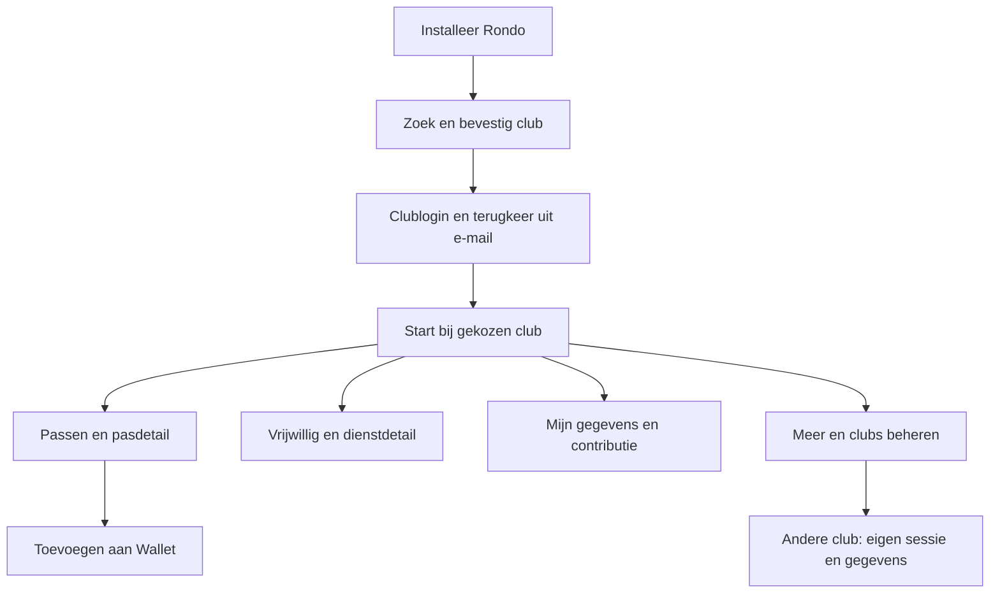

# Rondo-app: eerste release voor iPhone en Android

Datum: 6 september 2026. Status: voorstel ter bespreking; uitsluitend planning.

## Doel en vaststaande keuze

Eén publiek vindbare Rondo-app in de App Store en Google Play voor alle aangesloten clubs.
Een gebruiker vindt Rondo, kiest een club op naam, logt in en kan direct zijn pas en eigen
clubgegevens gebruiken. Meerdere clubs mogen worden opgeslagen; één club is tegelijk actief.
De gegevens, accounts en toegangsrechten blijven bij de betreffende club.
**Technisch uitgangspunt, bevestigd door de gebruiker: Capacitor met de bestaande React-interface
als lokaal verpakte app.** De technische proef valideert deze aanpak.

Dit document werkt het [eerdere technische ontwerp](mobile-app-design.md) uit tot een
eerste-releasevoorstel en vervangt daaruit tegenstrijdige scopekeuzes. De
[centrale Wallet-dienst](central-wallet-service.md) is een afzonderlijk traject met een eigen
proef en migratiepoort. Een app-pilot kan al werken met de bestaande Wallet-uitgifte.

## Wat de huidige code al biedt

Gecontroleerd in de repository op bovenstaande datum; dit is geen productie-audit.

| Onderdeel | Bron | Betekenis voor de app |
|---|---|---|
| Eigen gegevens, gezin, contributiestatus en betaalactie | `src/pages/Household/Household.jsx` | Hergebruik van bestaande schermen en serverrechten |
| Pas tonen en Apple/Google Wallet toevoegen, meerdere paskeuzes, gastpassen | `src/pages/Household/`, `includes/class-membership-pass-service.php` | De app verbetert de overdracht naar Wallet |
| Vrijwilligersdiensten | `src/pages/Vrijwillig/Vrijwillig.jsx`, `src/router.jsx` | Bestaande persoonlijke workflow als hoofdnavigatie |
| Persoonlijke toernooitaken en QR-scanner | `src/router.jsx` | Alleen zichtbaar voor bevoegde rollen |
| WordPress-login en sessieconfiguratie | `src/hooks/useAuth.js`, `src/api/client.js`, `functions.php` | Aanmelding buiten de browser vraagt een adapter |
| E-mailnotificaties | `includes/class-notification-channel.php`, `includes/class-mention-notifications.php` | Push is nieuw werk; geen bestaande algemene push-infrastructuur veronderstellen |
| OIDC voor vertrouwelijke clients | `includes/class-oidc-client-registry.php` | Niet zonder uitbreiding bruikbaar als native publieke client |

De huishoudsamenstelling komt steeds uit de actuele API. De app gaat niet zelf bepalen welke
ouders, kinderen of andere personen zichtbaar of bewerkbaar zijn.

## Eerste-release-schermen

Dit is de voorgestelde scherminventaris. Schermnamen hieronder zijn werklabels, geen definitieve
storeteksten. De eerste release richt de navigatie op leden, ouders en vrijwilligers; bestaande
bevoegde kaderfuncties blijven bereikbaar via Meer.

| Scherm | Wat staat erop? | Belangrijkste actie | Lege toestand of fout |
|---|---|---|---|
| 1. Welkom / club zoeken | Rondo, zoekveld voor clubnaam en plaats, scan clubcode, demo | Club kiezen | Geen resultaat: andere zoekterm of contact met club; geen accountgegevens vragen |
| 2. Club bevestigen | Clublogo, naam, plaats en gecontroleerd domein | Inloggen bij deze club | Onbereikbaar: opnieuw proberen; incompatibel: concrete hulp |
| 3. Inloggen | Bestaande clublogin in systeemvenster; uitleg over terugkeer uit e-mail | Inloggen of account activeren volgens clubbeleid | Verlopen link, annuleren en ontbrekende toegang met herstelactie |
| 4. Start | Actieve club, eigen pas als hoofdactie, volgende eigen dienst en relevante acties uit bestaande data | Pas tonen of persoonlijke actie openen | Geen pas/dienst: passende uitleg, geen gefingeerde activiteit |
| 5. Passen | Eigen en toegestane gezinspassen; lid/sponsor/rolkeuze waar nodig | Pas openen | Geen recht op pas: uitleg vanuit club; geen lege Wallet-knop |
| 6. Pasdetail | Club, naam, pastype, grote QR-code, geldigheid indien bekend | Toevoegen aan Apple of Google Wallet | Ongeldige/verlopen pas: verversen of club benaderen |
| 7. Mijn gegevens | Bestaand huishouden, contactgegevens, toegestane wijzigingen, contributiestatus | Gegevens wijzigen of betaling openen | Rechten en alleen-lezen oud-leden blijven leidend |
| 8. Vrijwillig | Bestaande eigen diensten en beschikbare inschrijvingen | Dienst bekijken/aanmelden | Vol, gesloten of gewijzigd: actuele servermelding, verversen |
| 9. Dienstdetail | Datum, tijd, plaats, uitleg en bestaande aan-/afmeldacties | Inschrijving bevestigen | Geen nieuwe annuleringsregels in de app introduceren |
| 10. Meer | Profiel, club wisselen, meldingen, hulp/privacy, accountverwijdering; bestaande bevoegde functies | Instelling of clubfunctie openen | Alleen beschikbare functies tonen |
| 11. Clubs beheren | Opgeslagen clubs, actief/inloggen nodig, club toevoegen/verwijderen | Club wisselen | Verwijderen legt uit dat lidmaatschap behouden blijft |
| 12. Meldingsinstellingen | OS-toestemming en voorkeuren per club/type | Meldingen toestaan of OS-instellingen openen | Weigering belemmert geen andere functie |
| 13. Herstel / update | Clubidentiteit en offline-, sessie-, storing- of versieprobleem | Opnieuw proberen, inloggen of store openen | Geen eindeloze spinner of witte WebView |

Voorstel voor de vaste ondernavigatie: **Start · Passen · Vrijwillig · Meer**.
Mijn gegevens is rechtstreeks bereikbaar op Start en via Meer. Bij uitgeschakelde
vrijwilligersfunctionaliteit vervangt Mijn gegevens de tab Vrijwillig. Laat een kleine
capability-configuratie de tabs bepalen; maak geen afzonderlijk app-product per club.
Tabs en Android-terug gebruiken dezelfde React-routegeschiedenis, zonder dubbele web- en native
navigatiebalk. Capacitor verzorgt de koppeling met de telefoonfuncties.

### Concreet schermverloop

Een terugkerende gebruiker landt op Start van de laatst actieve club. Een expliciete link of
melding gaat na een eventuele login naar het bedoelde scherm. Een verwijderde club wordt door
een oude melding niet opnieuw toegevoegd. Een clubwissel vraagt eerst afhandeling van
niet-opgeslagen wijzigingen en mag nooit de vorige club kort in beeld tonen.

### Pas- en betaalgedrag

- Pasdetail blijft rechtstreeks bruikbaar zonder Wallet te installeren. Eerste uitgifte en
  actuele controle vereisen verbinding. Offline openen van reeds toegevoegde Wallet-passen wordt
  op toestellen getest; de app belooft geen offline ledenadministratie of offline toegangscontrole.
- Bestaande rolkeuzes, sponsorvarianten en gastpassen behouden hun serverregels. Gastpassen
  krijgen een native deelvenster wanneer delen is toegestaan.
- Betalen opent de bestaande clubbetaalpagina in de systeembrowser. Terugkeer ververst de
  contributiestatus; terugkeer zelf is nooit betalingsbewijs. Mollie-webhooks blijven leidend.
- Er wordt in v1 geen Rondo-softwareabonnement in de app verkocht. De reviewvoorbereiding
  controleert de betaalcategorieën van de daadwerkelijk bereikbare workflows.

## Native meerwaarde en afbakening

Voorstel voor v1: veilige clublogin, clubwissel, directe Wallet-overdracht, deelvensters,
deep links en push. De eerste pushcategorieën zijn een herinnering aan een eigen dienst
en een directe vermelding voor bevoegde kadergebruikers. Beide zijn geplande uitbreidingen;
controleer bij implementatie welke bestaande gebeurtenisproducenten herbruikbaar zijn.

Push vraagt toestemming na uitleg in context. Een weigering laat de app volledig bruikbaar.
Een melding bevat standaard de clubnaam en een neutrale tekst, zonder namen van kinderen,
bedragen, QR-tokens of notitie-inhoud op het vergrendelscherm. Ontvangers en rechten worden
bij verzending en bij het openen opnieuw gecontroleerd. Bestaande e-mailvoorkeuren blijven intact.

Voorlopig later: biometrisch appslot, een nieuwe chat/inbox, nieuwe wedstrijd- of trainingsagenda,
offline schrijven, een samengevoegd overzicht over clubs en een volledige native herbouw.
De QR-scanner blijft voor bevoegden bereikbaar; een nieuwe native scanner komt alleen in v1
als de bestaande cameraweg de toestelproef niet doorstaat. Plan camera- en fototoestemming
uitsluitend op het moment dat de gebruiker die functie opent.

## Technische uitwerking: Capacitor

De gebruiker heeft Capacitor als uitgangspunt bevestigd. Eén gedeelde React-codebasis levert
een webbuild voor WordPress en een mobiele build voor iOS/Android. Componenten, veldformattering,
API-contracten en bedrijfsregels worden gedeeld. De mobiele build krijgt een eigen HTML-startpunt,
assetbasis en configuratiebron. Clubdata komt via de bestaande REST-API's met een mobiele
authenticatieadapter. Nieuwe schermen worden in React gemaakt; Capacitor levert native functies.

Gebruik Capacitors ontwikkeloptie `server.url` niet als productieontwerp: de officiële
[configuratiedocumentatie](https://capacitorjs.com/docs/config) beschrijft deze voor live reload.
De app bevat zijn eigen HTML, JavaScript, CSS en vaste afbeeldingen. Een WordPress-release
werkt het geïnstalleerde apppakket niet automatisch bij; wijzigingen daarin doorlopen de
mobiele releaseprocedure. Backenddata en toegestane clubconfiguratie blijven dynamisch.

### Benodigde aanpassingen

| Onderdeel | Werk |
|---|---|
| Startpunt/build | Mobiel HTML-startpunt en Vite-buildtarget; webbuild houdt zijn bestaande werking |
| Configuratie | Adapter vervangt direct lezen van `window.rondoConfig`; publieke clubconfig en geauthenticeerde gebruikersconfig apart ophalen |
| API-client | Clubbasis-URL en mobiele tokenauth; gerichte afhandeling voor loginverloop, hernieuwen en intrekking |
| Assets/URL's | Inventariseer `window.location`, relatieve media/links, theme-assets, redirects en `admin-post.php`-acties |
| Autorisatie | Mobiele sessie koppelen aan bestaande WordPress-gebruiker; dezelfde record-/veld-/rolcontroles toepassen |
| Wallet/downloads | Geautoriseerde mobiele endpoints of kort geldige overdracht voor bestaande cookie-/nonce-acties; nooit nonce of sessietoken in externe links |
| Native integratie | Wallet, systeembrowser, camera, share, push en veilige opslag via beoordeelde Capacitor-plugins |
| Caching | Geen webserviceworker in mobiele build; API-cache per club/gebruiker, expliciete verwijdering bij logout |

Begin met een apart mobiel buildtarget dat dezelfde frontendbron gebruikt. App-signing en
store-release zijn een afzonderlijke workflow van WordPress-deploy. Leg in fase A vast of de
iOS/Android-projecten in deze repository of een eigen repository met gedeeld frontendpakket
komen; geen gekopieerde frontend onderhouden.

De proef levert bewijs op fysieke iPhone én Android voor: eerste login, e-maillink vanuit een
andere browser, app gestopt tijdens login, herstart, sessieverloop, twee clubs, uitloggen,
Wallet toevoegen, foto/upload, PDF delen, betaalterugkeer, camera en push naar juiste club.
Documenteer daarna de concrete wijzigingsomvang en resterende risico's binnen Capacitor.
Alleen een aangetoonde blokkade is reden om een andere runtime opnieuw te bespreken.

### Authenticatie en gedeelde afspraken

- Een beheerd openbaar clubregister bevat stabiele club-ID, naam, plaats, logo en toegestaan
  HTTPS-domein; geen personen of e-mailzoekfunctie. Clubzoeken werkt ook zonder login.
- In v1 worden alleen aangemelde, gecontroleerde clubs aangeboden. Club-QR en uitnodigingslink
  verwijzen naar dat register. Zelf ingevoerde willekeurige websites horen niet in deze release.
- Een mobiel configuratie-endpoint van elke club meldt protocolversie en mogelijkheden.
  Sessies, lokale caches, routegegevens en pushregistraties worden op club én gebruiker gescheiden.
  Een gekloonde testsite krijgt een eigen installatie-ID en geen productieregistratie.
- Login gebruikt een systeemvenster, eenmalige code, S256-verifier, state, vervaltijd en exacte
  callbackvalidatie. Geen client secret in de app. De bestaande OIDC-clientregistratie is voor
  vertrouwelijke serverclients en kan niet direct als mobiele login worden ingezet. Ontwerpbasis:
  publieke native OAuth-client met Authorization Code + PKCE volgens
  [RFC 8252](https://datatracker.ietf.org/doc/html/rfc8252).
- Breid de bestaande identiteitslaag gericht uit voor publieke clients, REST-toegang en
  intrekbare apparaatsessies. De huidige code ondersteunt uitsluitend authorization_code,
  client_secret_basic en identiteitsscopes. Refresh en mobiele API-autorisatie zijn nieuw werk;
  behoud de bestaande FreeScout-clientcontracten en regressietests.
- Geef kort geldige access tokens met expliciete club/API-audience en beperkte scopes uit,
  plus roteerbare refresh tokens per apparaat/club. ID-tokens zijn geen REST-toegangsbewijs.
  Sla refresh tokens op in Keychain/Keystore via een beoordeelde plugin, nooit in gewone
  localStorage/Capacitor Preferences. De server bewaart hashes en kan sessies intrekken.
- De authenticatieadapter moet alleen na volledige tokenvalidatie de juiste WordPress-gebruiker
  vaststellen. Alle bestaande endpoint- en veldrechten blijven daarna van kracht. Bestaande
  browsercookie-/nonce-beveiliging blijft gelden voor browserverkeer; schakel deze niet globaal uit.
- De proef controleert eenmalig codeverbruik, gelijktijdig verversen, refresh-hergebruik, verlopen
  tokens, ingetrokken gebruikers en verkeerde club/audience. Leg tokenlooptijden en intrekking
  vast voordat productiecode wordt gebouwd. Gebruik native WordPress-opslag/API's.
- Toestelrequests gebruiken een gekozen Capacitor-netwerkadapter. Als browserrequests nodig
  blijken, sta alleen de exacte app-origin toe met correct begrensde CORS; geen wildcard met
  credentials. Test upload, download en redirects afzonderlijk. Native HTTP vervangt geen autorisatie.
- Deep links gebruiken geverifieerde Universal Links/App Links. Callbackhost is een nog te
  configureren Rondo-domein. Fallback voor niet-geïnstalleerde app en mislukte linkoverdracht
  krijgt een getest herstelpad; geen lange sessietokens in URL's.
- Alleen de lokaal verpakte appcode krijgt native pluginrechten. Clubdata wordt als data behandeld;
  geen externe clubpagina, iframe of willekeurig script laden met toegang tot de Capacitor-bridge.
  Externe links openen in een systeemvenster. QR, notificaties en redirects mogen geen willekeurige
  URL laten laden. Houd een strikte content security policy en veilige HTML-rendering aan.
- App-snapshot toont geen persoonsgegevens. Bij uitloggen worden cookies, caches en
  apparaatregistraties opgeruimd of ingetrokken, ook na offline uitloggen zodra verbinding terug is.
- Eén beheerde pushdienst houdt appbrede platformcredentials centraal. Clubregistratie kan met
  Wallet worden gedeeld, maar rechten, tokens, wachtrijen en storingen blijven gescheiden.
- App, bridge/API en clubtheme krijgen afzonderlijke versies. Test ondersteunde combinaties,
  bied een begrijpelijk updatescherm en houd backendrollback compatibel met uitgegeven apps.

## Storepublicatie en vindbaarheid

Gebruik Rondo's juridische entiteit als uitgever. Controleer of organisatieaccounts al bestaan
en verifieer naam, domein en D-U-N-S waar vereist. De kandidaatnaam is Rondo Club; beschikbaarheid
en herkenbaarheid moeten in beide Nederlandse stores worden gecontroleerd voordat artwork vastligt.
Maak Nederlandse screenshots van de echte release: clubkeuze, pas, eigen gegevens en diensten.
Controleer beschrijvingen en zoektermen op feitelijke functionaliteit. Rondo op nummer één bij
zoeken is geen leverbelofte. Meet na publicatie of proefgebruikers de juiste app herkennen.

Apple beoordeelt meerwaarde boven een verpakte website en staat een app met een clubselector toe;
extra native knoppen garanderen geen goedkeuring. Lever reviewers een geïsoleerde demo met
fictieve personen, werkende login, sample-QR en representatieve rollen. Plan een herstelronde
voor reviewfeedback. [Apple-reviewregels](https://developer.apple.com/app-store/review/guidelines/)

Voorbereiding omvat support- en privacy-URL's, leeftijd/doelgroep, Apple-privacyinformatie,
Google Data Safety, gebruikte SDK's en accountverwijdering. Verwijdering van de app-login en
beëindiging van clublidmaatschap moeten duidelijk onderscheiden worden; de precieze afhandeling
en eventuele bewaartermijnen vereisen vastlegging vóór publicatie. Google verlangt bij
accountaanmaak ook een extern verwijderpad.
[Google-accountverwijdering](https://support.google.com/googleplay/android-developer/answer/13327111)

Gebruik TestFlight en Play-testkanalen. De Google-eis van 12 testers gedurende 14 aaneengesloten
dagen geldt specifiek voor nieuwe persoonlijke accounts; pas hem niet automatisch toe op een
organisatieaccount. Controleer de toepasselijke eisen en SDK-/OS-minima opnieuw bij indiening.
[Google-testvereisten](https://support.google.com/googleplay/android-developer/answer/14151465)

## Bouwfases en beslismomenten

Dit is een engineeringraming voor één ervaren ontwikkelaar, geen deadline of goedkeuringsgarantie.
Na de proef wordt opnieuw geraamd. Ontwerpbesprekingen, accountverificatie en storereview kunnen
de kalenderduur verlengen; werkweken hieronder zijn geen doorlooptijd van Google of Apple.

| Fase | Resultaat | Voorlopige inspanning | Poort naar volgende fase |
|---|---|---|---|
| A. Schermkeuze en Capacitor-proef | Toestelbewijs, mobiele bootstrap en loginontwerp | 1–2 weken | Geen open login-/clubisolatieblokkade; schermscope akkoord |
| B. Appbasis | Clubregister, selectie, login, sessies, Start en navigatie | 2–3 weken | Twee afzonderlijke testclubs werken volledig |
| C. Ledenfuncties en native acties | Passen, gegevens, diensten, Wallet, delen/betalen/herstel | 2–3 weken | Kritieke gebruikersreizen slagen op beide platforms |
| D. Push en beheer | Twee categorieën, voorkeuren, intrekken, supportdiagnose | 1–2 weken | Juiste club/ontvanger; geen doorgestuurde privé-inhoud |
| E. Pilot en stores | Toestelmatrix, accountverwijdering, listings en release | 2–3 weken | Pilotcriteria en review gereed |

Appindicatie: **8–13 werkweken**, exclusief centrale Wallet-migratie en externe wachttijden.
Dit is een voorlopige raming; vooral de mobiele authenticatie en omzetting van PHP-configuratie
kunnen de omvang veranderen. Centrale Wallet is apart geraamd; gedeeld clubregister niet dubbel bouwen.
Begroot daarnaast macOS/iOS-buildcapaciteit, testtoestellen, hosting, monitoring, jaarlijkse
OS/SDK-updates, sleutel-/certificaatbeheer en ondersteuning. Bestaande store-accounttarieven
opnieuw controleren bij aanmelding; betaalde CI-diensten pas kiezen na de proef.

### Pilot en vrijgave

Voorgestelde pilot: 12–20 leden/ouders/vrijwilligers verspreid over AWC en een tweede aangesloten
club (of eerst een onafhankelijke testclub), op iOS en Android. Dit aantal is een productkeuze.
Test daarnaast kader, sponsor, meerdere rollen, gastpas, geen pasrecht, oud-lid en ingetrokken account.

Acceptatie: geen gegevens tussen clubs/gebruikers zichtbaar; alle kritieke tests slagen;
minstens 90% van proefgebruikers kiest zonder begeleiding de club, logt in en toont een pas;
de rest levert concrete verbeterpunten op. Geen open blokkerende login-, privacy-, betaal- of
pasfout bij vrijgave. Dit zijn streefcriteria, geen gemeten resultaten.

Meet alleen noodzakelijke gebeurtenissen, zonder pasinhoud of persoonsgegevens in analytics:
club gekozen, login geslaagd/mislukt, pas geopend, Wallet-overdracht gestart, foutcategorie.
Een gestarte Wallet-overdracht bewijst niet dat de gebruiker de pas heeft opgeslagen.

Gefaseerde publicatie: pilot, kleine publieke uitrol, uitbreiding na foutcontrole. Verifieer beide
storelinks en zoeken op de kandidaatnaam in de Nederlandse stores. Clubwebsites krijgen daarna
directe downloadlinks. Een teruggetrokken apprelease verwijdert reeds geïnstalleerde versies niet;
compatibiliteit en een servergestuurde beperking per problematische functie blijven nodig.

## Eerstvolgende bespreking

Bespreek de schermen en de voorgestelde tabindeling. Leg daarna uitgeversentiteit, tweede
pilotclub en opdracht voor fase A vast. De huidige opdracht is het uitwerken van het plan;
implementatie, accountaanmaak en migratie zijn vervolgstappen.
